# Devcon 8 Mumbai: Streaming Architecture Plan

> **Status:** working plan, v1, 2026-07-29. Owner: Levente Kiss.
> **Purpose:** decide yes or no on streaming all of Devcon 8, and if yes, be the architectural outlay EF asked for.
> **Deadline:** EF wants an answer in 2 to 3 weeks, so roughly **mid-August 2026**. Event is **3 to 6 Nov 2026**, about 14 weeks out.

> [!IMPORTANT]
> **Kept as written. Superseded on components, not on reasoning.**
>
> An architecture review on 2026-08-03 changed a number of the component
> decisions below. The reasoning in this document, the Swarm capacity
> analysis, the failure and threat models, the cost model and the go or
> no-go gates, is why the current design looks the way it does and remains
> the best account of it. The components are not current.
>
> What changed: the publish lease is gone, because two independent lanes make
> a forked feed impossible and leave nothing to arbitrate. The three shared
> origin gateways are gone, replaced by one prefetch node per feed so that no
> shared component sits behind the stages. The coverage fleet is gone,
> replaced by four levels of 160 prefetch nodes reaching all 512
> neighborhoods. The rented web2 mirror is gone, replaced by a standby stack
> we build ourselves. Pods carrying four to five stages each are gone, in
> favour of per-stage isolation. The viewer target moved from 20,000 to a
> 40,000 ceiling against an expected 4,000.
>
> The current component design is in [`../arch-explorer/`](../arch-explorer/).
>
> **Which sections are stale:** [6.2](#62-pushback-on-two-servers-per-stage) pods,
> [7.5](#75-how-many-nodes-do-we-need-and-where) fleet sizing,
> [8.4](#84-the-degradation-ladder) and [8.5](#85-web2-mirror-choice) the YouTube mirror,
> and the two fleet rows in [13.2](#132-everything-else). Each one says at its end what
> replaced it. Everything else, including every number, is current.

---

## 0. TL;DR

**Recommendation: conditional yes.**

The conditions are not "more engineering". They are three things that make the downside survivable:

1. **An always-hot web2 mirror on every stage from day one.** Not a break-glass procedure, a second output that is always running. This is what makes "yes" a responsible answer rather than a gamble.
2. **A gateway tier that carries the default viewer.** Direct browser-to-Swarm retrieval at Devcon scale would overload the public network. The numbers are in [section 7](#7-layer-2-swarm-capacity-analysis) and they are not close.
3. **Three numbers pinned down by EF before we sign** (design concurrency, publishing surface, desktop-to-mobile ratio). Stage count is our own call and we are planning at **20**, the conservative end, because scaling a 20-stage plan down is easy and discovering in October that 8 was optimistic is not.

**What the money looks like.** Compute and Swarm storage are rounding errors. Egress bandwidth is 85 to 95% of the bill and it scales with *viewers*, not stages.

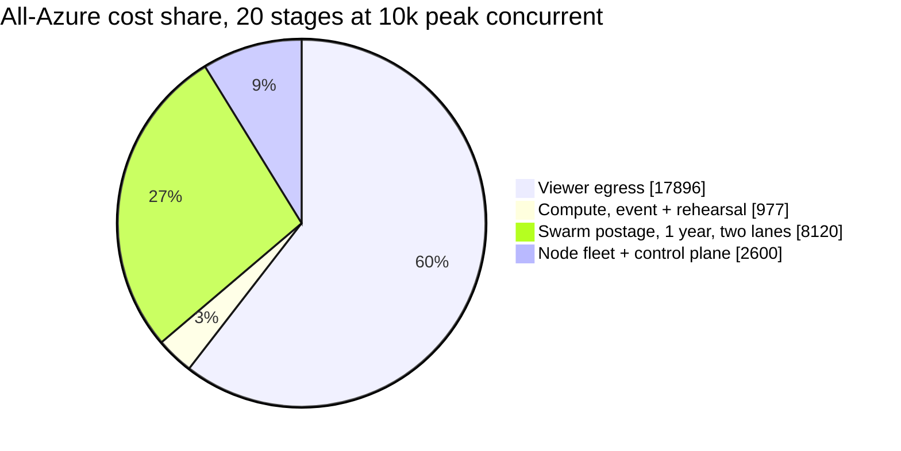

**And the single largest lever is not engineering, it is where we buy bandwidth.** Because a Swarm segment's address is its content hash, segments are immutably cacheable, which gives a CDN a near-perfect hit rate and collapses the origin fleet to a handful of VMs. That turns the same 20k-peak event from **$35,006 of Azure egress into about $2,451**, a 93% saving, for **under one engineer-week of extra setup**. Full comparison of seven providers and four deployment variants in [13.3](#133-provider-comparison-the-same-egress-priced-seven-ways) and [13.4](#134-four-deployment-variants-priced-and-scored).

**The CDN has to be a third party, and that is a finding rather than a preference.** Azure Front Door egress in India is $0.109/GB to 10 TB and $0.085/GB from 10 to 50 TB, against $0.12 then $0.085 for raw Azure VM egress. They cost the same, so fronting Azure with Azure's own CDN saves nothing. The 93% comes from bunny.net Volume at $0.005/GB. Front Door above 150 TB is quoted "contact sales", so the 40,000 ceiling cannot be priced from published Azure rates at all.

Costed at **20 stages**, the planning number for this document:

| Variant | 10k peak, all-in | 20k peak | **40k peak, the ceiling** | Extra effort |
|---|---|---|---|---|
| A: all Azure | $29,596 | $46,703 | **$80,918** | baseline |
| B: Azure ingest + Vultr Mumbai gateways | $13,595 | $15,734 | $20,011 | +1.5 to 2.5 weeks |
| C: cheapest multi-provider | ~$13,100 | ~$14,450 | ~$17,200 | +3 to 4 weeks, **not worth it** |
| **D: CDN-fronted, recommended** | **$13,078** | **$14,148** | **$16,286** | **+0.5 to 1 week** |

**The decisive argument is not the event bill, it is load testing.** Three 6-hour runs held at 20k peak is 356.4 TB, which costs **$29,304 on Azure against $1,782 on a CDN**. At the 40k ceiling it is $57,816 against $3,564. Load testing alone costs three to four times more on Azure than the whole event does under Variant D. Under A we would ration tests to protect the budget, and rationing tests is exactly how we reach Gate 2 in October without the evidence to say yes.

**Funding: we have no credits today.** The highest-probability path is EF covering delivery infrastructure as an event line item, then Swarm Foundation co-funding the R and D half. Microsoft for Startups self-service is up to $5,000 with no investor needed and is worth filing this week. Full options with sources in [13.11](#1311-funding-and-sponsorship-options). **The strategic point: fix the architecture first so the ask at the ceiling is $16k rather than $81k.**

**What is genuinely new risk.** Not the pipeline. We have measured the pipeline. The risk is (a) the contribution hop we do not own, (b) operating 5 to 20 parallel streams for 12 hours a day when everything we have proven is single-stream, and (c) putting load on a volunteer network with no rollback.

---

## 1. What we are being asked to commit to

From the James Lynch and Carlota Voorvart meeting:

| Fact | Consequence for us |
|---|---|
| **All of Devcon or nothing.** No partial, no selected stages. | We cannot de-risk by shrinking scope. The only de-risking lever is the fallback ladder. |
| EF **prefers** us over the web2 alternative, and would rather dogfood Swarm. | We have goodwill, not a lowered bar. |
| **Priority one is a working, stable, reliable stream.** | Reliability outranks purity. This is now a design principle, not a compromise. |
| "It is expected that we don't commit to something we can't handle." | An honest no costs us nothing. The door stays open for Devcon 9 and other EF events. |
| Gradual decentralization is fine, on-ramps and "corner cutting" acceptable. | We are explicitly permitted a hybrid. Use that permission. |
| 2 to 3 weeks to answer, with an architectural sketch including fallbacks. | This document. |
| Significant money from our side. | Budget is ours to carry, so the egress number in [section 13](#13-cost-model) is the one that decides feasibility. |

### 1.1 The decision this reverses

Our previously locked position was **Swarm-only delivery, no web2 CDN, no YouTube backstop**. The meeting outcome supersedes it:

> "The team decided to utilize centralized gateways as a necessary fallback to guarantee performance and stability."

I want to be direct about this, because it is the part I know you dislike. **The fallback is what buys us the right to try the ambitious thing.** Without it, every architectural decision has to be defensive, and we would end up shipping something conservative anyway. With it, we can run real decentralized delivery as the default path and treat the mirror as insurance we hope never pays out. That is a strictly better outcome for Swarm than a cautious Swarm-only design, and a far better outcome than a no.

---

## 2. Requirements, and the four numbers that are not pinned down

### 2.1 What we know

| Parameter | Value | Source |
|---|---|---|
| Dates | 3 to 6 Nov 2026, 4 days | EF |
| Content hours | ~12 h/day | Meeting |
| Ingest protocol | SRT preferred, RTMP acceptable | Meeting |
| Audience character | mobile-first, global with India weight | Meeting |
| Venue | JIO World Centre, Mumbai | EF |

### 2.2 The four open numbers

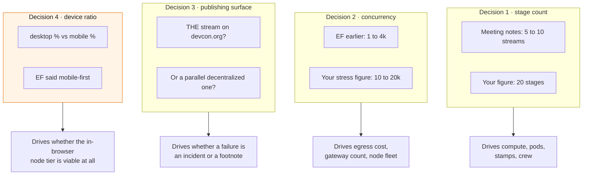

**Decision 1: we are planning at 20 stages.** Devcon 7 had 6 main stages plus roughly 70 spaces, and the meeting notes say 5 to 10 concurrent streams, so 20 is the conservative end of our exposure rather than the expected case. **Everything in this document is costed and sized at 20**, on the principle that it is far easier to scale a 20-stage plan down than to discover in October that 8 was optimistic. We should still get a room list from EF before signing, because 20 stages changes crew, badges, recording boxes and rehearsal time even though it does not move the egress bill.

At 20 stages the concrete build parameters are: **4 pods of 5 stages (8 VMs) or 7 pods of 3 (14 VMs)**, **about 150 vCPU** of transcode, 20 SRT feeds, 20 local recording boxes, and **2 YouTube channels** for the mirror, per the channel cap noted in [8.5](#85-web2-mirror-choice).

**Decision 3 changes the risk profile more than any technical choice.** If we are the only stream on devcon.org, a Swarm-path failure is an event incident with EF's name on it. If we are the decentralized stream alongside an EF-operated one, the same failure is a footnote. The answer also determines whether our web2 mirror is *ours* to build or is simply EF's existing stream.

**Decision 4 is newly urgent** given the in-browser node results in [section 8.3](#83-own-node-tier-what-we-now-actually-know). EF said mobile-first. An in-browser Bee node holding 200 concurrent WebSocket connections is a desktop proposition. If the audience is 80% mobile, the direct tier is a small-single-digit-percent story regardless of how good weeb-3 gets, and we should size it accordingly rather than hoping.

### 2.3 Assumptions I am using until told otherwise

- Delivery rendition 1080p30 at 3 Mbps, 2 second segments. Ladder adds 720p at 1.5 Mbps,
  480p at 0.7 Mbps and 360p at 0.4 Mbps, so **four rungs summing to 5.6 Mbps per stage**.
- Every stage is published **twice, on two independent lanes**. Both lanes carry identical
  bytes, so they land on identical chunk addresses and the network stores one copy, but we
  pay egress and postage twice.
- Average delivered bitrate across a mobile-heavy audience: **2.2 Mbps**.
- Average concurrent viewers over a 12 hour day: **45% of peak**.
- Contribution feed arrives as one produced program feed per stage at 5 to 10 Mbps.

---

## 3. Design principles

1. **Reliability outranks purity, and we say so out loud.** EF said it first. Writing it into our own principles is how we avoid relitigating it at 3am during the event.
2. **Every tier degrades to a simpler tier, and the last tier cannot fail.** No tier is allowed to be the only path to a working stream.
3. **The default path is the decentralized path.** Fallbacks are automatic, monitored, and hopefully idle. Decentralization is the product, not the demo.
4. **Fallbacks are hot, not cold.** A cold fallback is a plan. A hot fallback is a fact. Cold failover during a keynote is how you turn a 10 second glitch into a 4 minute outage.
5. **Instrument everything, and treat the event as the load test we get paid for.** The measurements are a deliverable in their own right, for the Devcon 8 talk and for Swarm.
6. **Buy nothing we can rent, build nothing we can configure.** We have 14 weeks. See the pushback in [section 10](#10-layer-5-control-plane).
7. **No experiment ships without a kill switch we can pull for all viewers in under 30 seconds.**

---

## 4. System architecture

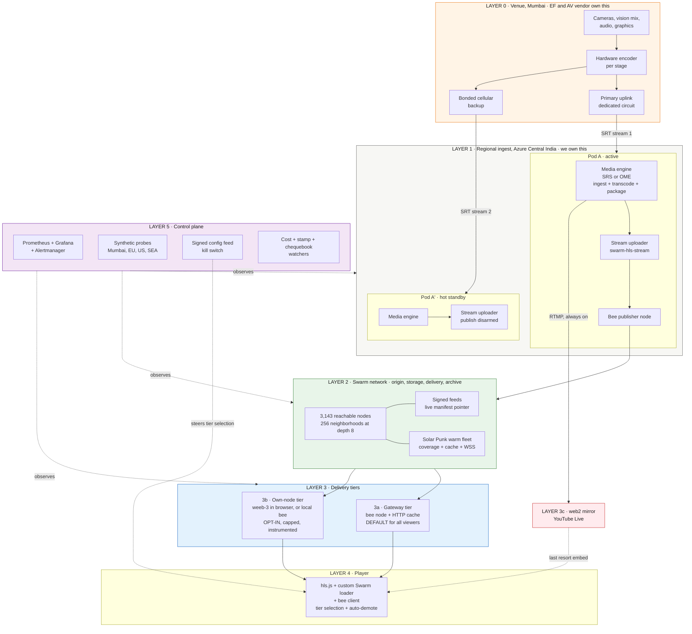

### 4.1 The publish path, in sequence

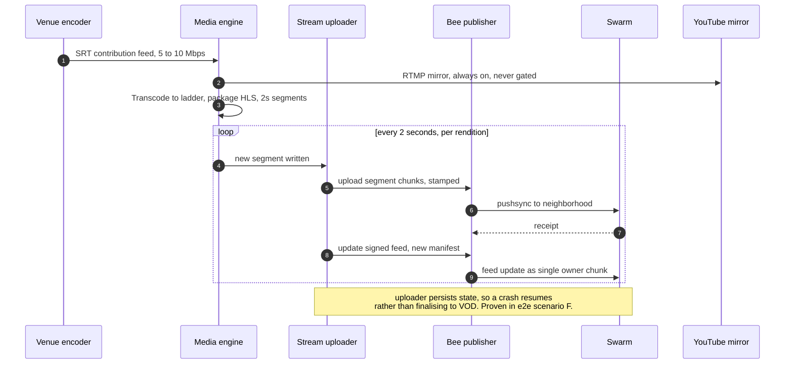

### 4.2 The playback path

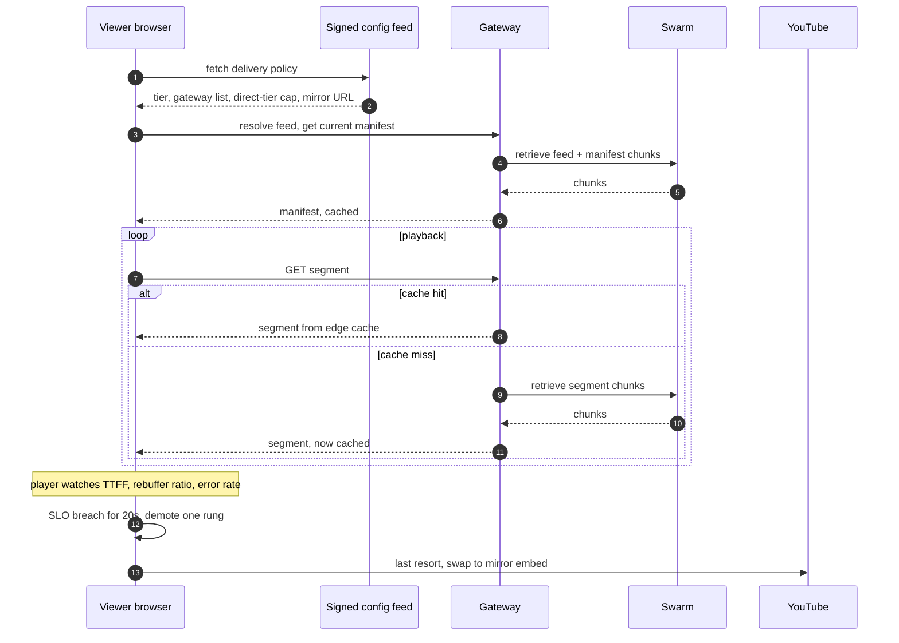

---

## 5. Layer 0: venue and contribution

**This is the highest-risk link in the entire chain and we do not own it.** Every live event post-mortem I have read comes back to the contribution hop, not the cloud.

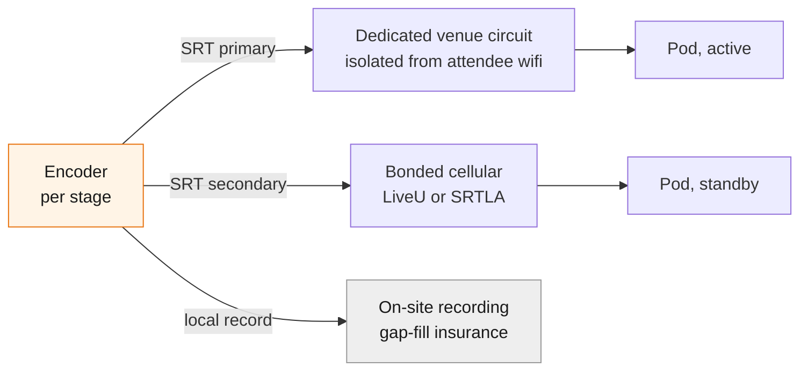

### 5.1 What we need from EF and the AV vendor

The existing [questionnaire](questionnaire.md) covers most of this. The meeting outcome adds one sharper question that is now a blocker:

> **New blocker question:** can your per-stage encoders emit **two simultaneous SRT outputs to two different hosts**? If not, we need either an on-site relay box per stage that fans out, or we accept a single contribution path and label it as an unmitigated single point of failure owned by EF.

Stage-level redundancy in the cloud is worthless if the feed reaching the cloud has one path. Hardware encoders from Haivision, Videon and Teradek generally do dual-push. OBS does not do it cleanly.

### 5.2 On-site footprint

Small, as previously scoped: a monitoring workspace with power and wired ethernet near production, one local-recording box per stage if EF's vendor is not already recording, seats and badges for 2 to 3 crew.

**Local recording is cheap insurance and I would insist on it.** If the contribution path drops for 90 seconds, the live stream has a gap, but the archive does not have to. Post-event we can splice the local recording into the Swarm archive and the permanent record is clean.

---

## 6. Layer 1: regional ingest and publish

### 6.1 Where

**Azure Central India (Pune).** Roughly 150 km from the venue, single-digit millisecond RTT, and the widest SKU availability of the Indian regions. West India (Mumbai) is physically closer but historically SKU-limited, so verify before committing. Keep a **secondary region warm** (South India or Southeast Asia) for the case where Central India itself has a problem.

### 6.2 Pushback on "two servers per stage"

Your proposal: two servers per stage, near Mumbai, switch to the backup if one fails.

**I agree with the redundancy goal and disagree with the unit.** At 20 stages, "two per stage" is 40 VMs. Each one carries a media engine, an uploader, a Bee node, a postage stamp, and a chequebook. That means **40 chequebooks to fund and monitor**, and our own `pac-bench` work found that chequebook funding, not segment size, is the single biggest lever on retrieval health. Forty of them is not redundancy, it is forty chances to have one underfunded at 11am on day two.

**Counter-proposal: pods.** A pod is one media engine plus one uploader plus one Bee node, carrying 4 to 5 stages, with a hot standby fed by the encoder's second SRT output.

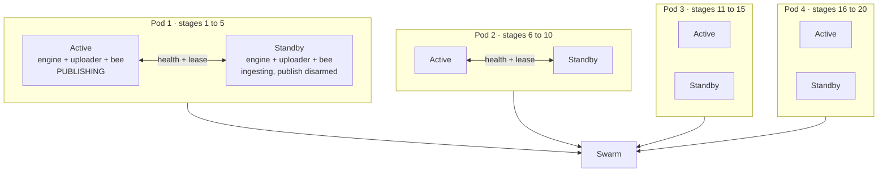

| | Per-stage, 40 VMs | Pods of 5, 8 VMs |
|---|---|---|
| Blast radius of one failure | 1 stage | 5 stages |
| Chequebooks to fund and watch | 40 | 8 |
| Stamps to watch | 40 | 8 |
| Config surface | 40 | 8 |
| Failover complexity | 40 pairs | 4 pairs |
| Compute cost | similar | similar |

The blast-radius argument for per-stage is real but it is answered by the standby being **hot**. If failover works, blast radius is a 2 to 4 second discontinuity, not an outage. If failover does not work, per-stage isolation only means you lose one stage instead of five, and you have already failed. **So spend the effort on making failover work rather than on subdividing it.** Test it with the existing `streaming-infra-manager/e2e` suite, which already covers uploader hard-crash recovery and engine restart re-announce.

Middle ground if you want smaller blast radius: pods of 3, so 7 pods at 20 stages, 14 VMs. Still an order of magnitude fewer chequebooks than 40.

**What we decided instead, and why this argument lost.** The review went the other way: **one worker per stage, plus two standing spares, so 22 machines.** Per-stage isolation won, and the pod argument above is kept because its reasoning is still the reason the decision was hard.

The chequebook objection is what changed, not the blast-radius maths. The design now runs **one funded publisher node per rung per lane, which is 160 chequebooks**, four times the 40 this section rejected as unmanageable. That is affordable only because the stamp manager automates funding and expiry as a lifecycle rather than a chore, so the cost of a chequebook stopped being human attention. Once that held, the objection to per-stage isolation stopped being decisive, and 160 nodes buys something pods cannot: a full batch or a drained chequebook costs **one rung of one lane** instead of a whole pod.

Note also that the second lane, not a hot twin, is what carries a stage through failure (see §6.3 below).

### 6.3 Redundancy, concretely

The hard part of standby publishing to Swarm is that **two uploaders publishing the same feed would fight over the feed index**, and a split-brain on a signed feed is worse than an outage because it corrupts the archive. There are two ways to stop that. One is to arbitrate who may sign. The other is to make sure there is only ever one place a writer could run from. **We do the second, because it needs no coordination at all.**

- **Two independent lanes, not one lane with a standby.** Every stage publishes twice, to two sets of feeds sharing no signing key, no feed and no postage batch. A fork between them is impossible by construction rather than policed, and there is nothing left for a lease to arbitrate.
- **One writer per feed, pinned to one host.** The supervisor guarantees one process on that host, so there is no second place a writer could run from and no distributed lock to get wrong. A frozen process stalls that stage's lane, the supervisor kills and restarts exactly one, and the other lane carries the stage meanwhile.
- **Standing spares rather than hot twins.** A transcode worker is stateless, so a spare has nothing to move across and can come up from a clean image. Twenty workers plus two idle spares is 22 machines against 40 for one-to-one pairing, and it buys about 30 seconds of black instead of none. Paying twice for compute to avoid those 30 seconds is not a trade worth making.
- **A discontinuity is a supported state, not a failure.** When a spare takes over it picks the feed up at the next index and arms a discontinuity marker. Our e2e scenario B already proves the player handles a discontinuity plus clean resume.

The cost consequence is in [6.4](#64-transcode-sizing): because no standby transcodes in parallel, transcode compute is sized once rather than doubled.

### 6.4 Transcode sizing

| Stages | CPU path, x264 veryfast, 4 rungs | GPU path, NVENC |
|---|---|---|
| 8 | 60 vCPU, 4x D16as_v5 | 2x A10 |
| 20 | **150 vCPU, 10x D16as_v5** | 3x A10 |

CPU is the simpler operational story and the cost difference is small at these volumes. **Start on CPU.** Revisit GPU only if we end up at 20 stages with a full ladder.

**A note on ABR.** The media engine can produce a ladder today. What does not exist yet is ABR *over Swarm*: the uploader writing variant playlists and the player switching between them through the Swarm loader. That is real work, and it is the single most valuable feature for a mobile-first audience. If it is not ready, we ship a single rendition, which is a meaningful quality compromise for exactly the audience EF cares about. **This should be the top engineering priority if we say yes.**

---

## 7. Layer 2: Swarm capacity analysis

Numbers below are from a live SwarmScan snapshot taken on 2026-07-29 plus the January 2026 State of the Network report.

### 7.1 What the network actually looks like today

**3,143 reachable nodes.** Neighborhood population by depth:

| Depth | Neighborhoods | Nodes per nbhd, min | median | max | Empty | Under 4 nodes |
|---|---|---|---|---|---|---|
| 6 | 64 | 44 | 49 | 56 | 0 | 0 |
| 7 | 128 | 20 | 24 | 31 | 0 | 0 |
| **8** | **256** | **8** | **12** | **16** | **0** | **0** |
| 9 | 512 | 2 | 6 | 10 | 0 | 14 |
| 10 | 1,024 | 1 | 3 | 6 | 0 | 722 |
| 11 | 2,048 | 0 | 1 | 4 | 194 | 2,017 |

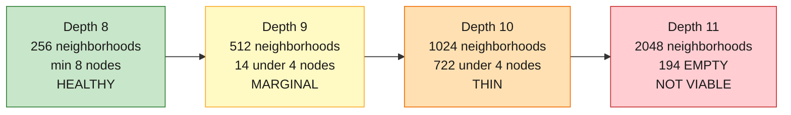

**Three conclusions that matter:**

1. **The usable storage radius is 8, giving 256 address-space slots.** The price oracle targets fourfold redundancy as a safe minimum, and depth 8 clears it comfortably at a minimum of 8 nodes per neighborhood. Depth 9 already has 14 neighborhoods below the fourfold floor. So **256 is the real number** whenever we talk about covering the address space.
2. **The network is geographically concentrated in Europe.** 1,723 of 1,939 active staking nodes are in Finland, and Germany holds the largest count of reachable nodes at 2,332. There is effectively **no Swarm presence in India.** Every chunk retrieval from a Mumbai viewer crosses to Europe and back, over an overlay that may take several hops to get there. This is the strongest argument in this document for both the gateway tier and for placing our own nodes in India.
3. **The network was contracting, not growing, going into 2026.** January was down across rewards, staking nodes, reachable nodes and winning nodes versus December. Do not plan on the network being bigger in November than it is now.

### 7.2 The load model has three dimensions, not one

Conflating these is the most common mistake in this analysis.

```mermaid
flowchart TB
    subgraph WRITE["WRITE · scales with STAGES · trivial"]
        W1["20 stages x 5.6 Mbps ladder = 112 Mbps unique"]
        W2["+7.5% MEDIUM parity = 120 Mbps<br/>x 2 lanes = 241 Mbps pushsync"]
        W3["7 new chunks/s per neighborhood<br/>at depth 9"]
        W1 --> W2 --> W3
    end
    subgraph READ["READ BANDWIDTH · scales with VIEWERS · the classic problem"]
        R1["Each viewer at 2.2 Mbps<br/>= 67 chunk fetches/s"]
        R2["~4 overlay hops per fetch"]
        R3["~4x network-wide amplification"]
        R1 --> R2 --> R3
    end
    subgraph CONN["CONNECTIONS · scales with BROWSER NODES · newly discovered"]
        C1["Each weeb-3 node holds<br/>up to 200 stable WS connections"]
        C2["Browsers can only dial nodes<br/>exposing wss://, opt-in since Bee 2.7"]
        C3["Ceiling is WSS-reachable node count,<br/>NOT the 3,143-node network"]
        C1 --> C2 --> C3
    end
    style WRITE fill:#c8e6c9,stroke:#2e7d32,color:#1a1a1a
    style READ fill:#ffcdd2,stroke:#c62828,color:#1a1a1a
    style CONN fill:#fff4e6,stroke:#e8730f,color:#1a1a1a
```

**The write side is a non-event.** Twenty stages of full-ladder publishing on two lanes is about 241 Mbps of pushsync and roughly 7 new chunks per second per neighborhood at depth 9. The network will not notice us uploading Devcon.

### 7.3 Where read bandwidth breaks: the direct-client number

You asked whether there are scenarios where the stress is too much for the full nodes. **Yes, and it arrives earlier than expected.**

| Peak direct clients | Edge demand | Network-wide with 4 hops | Per node average | vs ~10 Mbps typical Bee budget |
|---|---|---|---|---|
| 4,000 | 8.8 Gbps | 35.2 Gbps | **11.2 Mbps** | **already over** |
| 10,000 | 22.0 Gbps | 88.0 Gbps | **28.0 Mbps** | 2.8x over |
| 20,000 | 44.0 Gbps | 176.0 Gbps | **56.0 Mbps** | 5.6x over |

**Even at EF's own conservative 4,000, direct retrieval exceeds what a typical Bee node is documented to want.** And that is the *average*, which is the optimistic framing. The real shape is worse:

**The hot-chunk problem.** One 2 second segment at 3 Mbps is about 750 KB, roughly 183 chunks. Each chunk hashes independently, so those 183 chunks land in 183 *different* neighborhoods. Twenty thousand viewers all want all 183 chunks inside the same 2 second window.

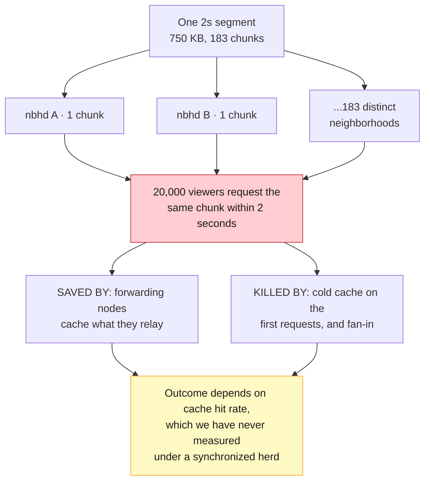

Swarm's saving grace is that **forwarding nodes cache what they relay**, so a popular chunk replicates along request paths and behaves somewhat like a CDN. That is a real mechanism and it is why this is a risk rather than a certainty. But we have never measured the hit rate under a synchronized thundering herd, and Devcon is not the place to find out with no rollback.

**Conclusion: the gateway tier is load-bearing infrastructure, not a corner cut.** A gateway fetches each segment once and serves it to thousands over plain HTTP. That decouples Swarm load from viewer count entirely. With 10 gateways and 20 stages, Swarm sees about 600 Mbps of retrieval instead of 44 Gbps.

### 7.4 The connection ceiling, which is the newer and sharper constraint

The in-browser node work surfaces a limit that has nothing to do with bandwidth. **weeb-3 holds up to 200 stable WebSocket connections.** Two consequences:

**Consequence one: inbound connection load on Bee nodes.** Ten thousand browser nodes at 200 connections each is 2,000,000 inbound connections. Spread evenly across 3,143 nodes that is roughly 636 inbound connections per node, which is far beyond what a default Bee node is configured to accept. **Connection exhaustion would bite before bandwidth exhaustion does.**

**Consequence two, and this is the important one: browsers can only dial nodes that speak `wss://`.** Bee 2.7.0 introduced AutoTLS and secure WebSocket p2p transport, and it is explicitly **opt-in**. So the addressable set for a browser node today is not 3,143 nodes, it is however many operators have enabled WSS, which is likely a small fraction.

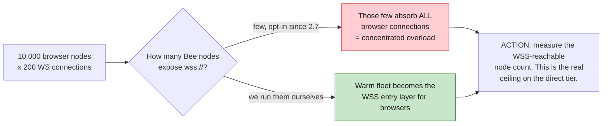

**This reframes the warm fleet's job.** It is not only about holding a near copy of every chunk. It is the **WSS entry layer that makes in-browser nodes possible at all**, and it needs India presence for exactly the same reason the gateway tier does.

**Immediate action, cheap and high value:** count the WSS-reachable nodes on mainnet today and track it weekly. That single number bounds the direct tier more tightly than any bandwidth figure, and I do not think anyone has measured it. It is also a genuinely useful contribution back to Swarm, and good material for Abel.

### 7.5 How many nodes do we need, and where

**The key insight: our node count is driven by gateways, coverage and WSS entry, not by viewers.**

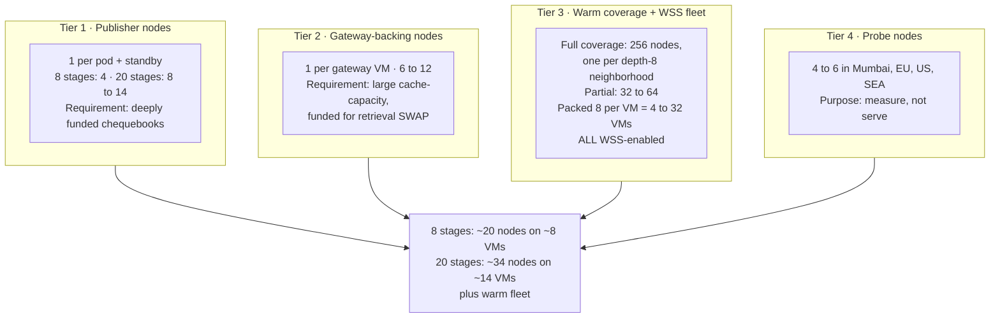

**Recommended starting fleet, 20 stages:**

| Tier | Nodes | Mode | Placement | Why |
|---|---|---|---|---|
| Publisher | 8 to 14 | light, funded | Azure Central India, with the pods | Push our chunks in |
| Gateway-backing | 8 to 12 | light, big cache | India heavy, plus EU and US | Serve the default viewer |
| Warm coverage + WSS | 32 partial, 256 full | full, reserve-syncing, **WSS on** | cheap-bandwidth hosts, India + EU | Near copy of every chunk, and the browser entry layer |
| Probe | 4 to 6 | light | Mumbai, Frankfurt, Virginia, Singapore | Tell us the truth about retrieval |

**On the warm coverage fleet.** Full coverage means one node in each of the 256 depth-8 neighborhoods, so every chunk of our stream has at least one copy on hardware we control, funded, WSS-reachable and close to viewers. Bee nodes pack fine at roughly 8 per 16-core VM, so 256 nodes is about 32 VMs, not 256 machines. Each node needs its overlay address mined into its target neighborhood, and SwarmScan's neighborhood suggestion API exists precisely to pick the least populated ones.

**Be honest about what this is.** A full 256 node coverage fleet means we are substantially serving our own content from our own infrastructure, using Swarm as the addressing and verification layer rather than as the storage market. That is a legitimate architecture and it is how most decentralized systems bootstrap, but we should not describe it to EF as the network carrying Devcon. Start with a partial fleet of 32 and let measurement decide.

**Warning on where to host this.** See [section 13.5](#135-where-each-workload-should-actually-run). Do not put a bandwidth-heavy Swarm fleet on Azure. Hetzner EU at 20 TB included per instance is close to free for coverage nodes, with a few India-local nodes for the WSS entry role.

**What the fleet actually is now.** The tiering above was replaced by two roles and a much larger count: **160 publisher nodes**, one per rung per stage per lane, and **640 prefetch nodes**, one per feed repeated at four distances so that every one of the 512 neighborhoods at depth 9 holds a node of ours. The shared gateway tier is gone entirely, because a CDN in front of the level-0 prefetch nodes does that job without any component sitting behind all the stages. Probes stay at four.

Covering depth 9 rather than the depth 8 this section argues for is deliberate: 512 sections cover the 256 anyway, and the thin neighborhoods at depth 9 are exactly where our own node is worth the most. The 800-node fleet is also why the cost rows in [13.2](#132-everything-else) are still a placeholder.

### 7.6 How we know when to add nodes

| Signal | Source | Green | Escalate at | Action |
|---|---|---|---|---|
| p95 chunk retrieval latency, Mumbai probe | probe nodes | < 400 ms | > 800 ms | add gateway-backing nodes in India |
| Retrieval timeout rate | probe + gateway | < 0.1% | > 1% | add warm coverage nodes |
| Gateway origin-fetch p95 | gateway bee | < 600 ms | > 1.2 s | raise cache-capacity, add nodes |
| Gateway cache hit ratio | gateway HTTP | > 95% | < 85% | more gateways, longer segment TTL |
| **WSS-reachable node count** | our own scan | stable or rising | falling, or browser dial failures > 1% | **add WSS nodes to the warm fleet** |
| **Inbound connections per warm node** | bee API | < 60% of limit | > 80% | raise limits, add nodes, cap direct tier |
| Chequebook balance, any node | bee API | > 1.0 BZZ | < 0.5 BZZ | **auto top-up, page on failure** |
| Postage batch TTL | `stamp-monitor` | > 14 days | < 7 days | top up via `postage-batcher` |
| Batch utilisation | bee API | < 70% | > 85% | dilute the batch |
| Neighborhood population, our depth | SwarmScan | >= 4 | < 4 | place a node there ourselves |
| Player rebuffer ratio | player beacons | < 0.5% | > 2% | demote a tier, investigate |
| TTFF p95 | player beacons | < 3 s | > 6 s | demote a tier |

**The chequebook row is the one I would put on the wall.** Our own `pac-bench` v1 found that with both sides funded, roughly 8 Mbps streamed lag-free with headroom and the ceiling was never reached, and that **the real lever is chequebook funding, not segment size**. An underfunded chequebook throttles retrieval past the free allowance. The `e2e` suite already has a preflight gate requiring at least 0.5 BZZ on the uploader chequebook, failing if it cannot top up. **Promote that from a test gate to a continuously enforced production invariant.**

Also from `pac-bench`: **RACE plus PARANOID is a trap.** Whatever redundancy level and download strategy we ship, that combination is excluded. Note this sits alongside, and does not contradict, the in-browser finding that race versus normal fetch made little latency difference on a well-replicated VOD. Different layer, different payload, and the browser result is explicitly flagged as subject to change with live data.

---

## 8. Layer 3: delivery tiers and the degradation ladder

### 8.1 The three tiers

```mermaid
flowchart LR
    subgraph A["3a · Gateway tier"]
        direction TB
        A1["Bee node + HTTP cache<br/>+ Front Door or CDN"]
        A2["DEFAULT for every viewer"]
        A3["Decouples Swarm load<br/>from viewer count"]
    end
    subgraph B["3b · Own-node tier"]
        direction TB
        B1["weeb-3 in browser,<br/>or local bee at :1633"]
        B2["OPT-IN, capped, instrumented"]
        B3["The dogfooding story<br/>and the load-test data"]
    end
    subgraph C["3c · Web2 mirror"]
        direction TB
        C1["RTMP to YouTube Live,<br/>always on from day one"]
        C2["LAST RESORT for viewers,<br/>never the default"]
        C3["Free egress, unlimited concurrency,<br/>best mobile behaviour"]
    end
    A -->|"opt in"| B
    B -->|"demote"| A
    A -->|"demote"| C
    style A fill:#c8e6c9,stroke:#2e7d32,color:#1a1a1a
    style B fill:#fff9c4,stroke:#f9a825,color:#1a1a1a
    style C fill:#ffcdd2,stroke:#c62828,color:#1a1a1a
```

Note 3b is not a *fallback* from 3a. It is a *more decentralized* option a self-selected group opts into, and it demotes back to 3a when it struggles.

### 8.2 Gateway tier, and what "security" actually means here

You want "a massive gateway system with proper security in place to only allow users to see the content we want through the gateways." There are two very different things in that sentence.

**Achievable and correct:** restrict *what the gateway will serve*. The gateway holds an allowlist of our feed owners and manifest references and refuses everything else. This stops the gateway being used as a free open proxy for arbitrary Swarm content, which is a real cost and abuse problem. Do this.

**Not achievable, and we should not imply it:** restricting *who can watch*. Swarm content is public by address. Anyone with the manifest reference can fetch it from any gateway or their own node. Real access control means ACT with grantees, which is incompatible with public conference streaming and with gateway caching.

For a public conference stream that is completely fine, and it is what EF wants. Just do not write "access control" in a document EF reads and let them think it means something it does not.

Gateway hardening list:
- Reference allowlist, per event and per stage.
- Rate limit per IP and per session, with a burst budget sized for a legitimate player.
- Azure Front Door or Cloudflare in front for DDoS absorption and TLS termination.
- Cache segments aggressively and immutably. Content addressing means a segment can be cached forever, a genuine advantage over web2 HLS.
- Cache the manifest for a fraction of the segment duration only.
- No Swarm write API exposed. Ever.
- Per-gateway cost alarm with a hard egress ceiling that trips before the budget does.

### 8.3 Own-node tier: what we now actually know

This section is rewritten on the strength of the in-browser node POC. **I was wrong to call this a research project.** It is a measured comparison with a chosen implementation, and it changes the tier from aspiration to something with a real number attached.

**Method, which is the right method:** play back an existing, well-replicated VOD to eliminate other variables, and establish a bandwidth baseline from empirical evidence rather than theory. Ant and kabashira ruled out as different-purpose.

| Implementation | Startup vs 2s segment cadence | Erasure coding + race | Connection pool | Notes |
|---|---|---|---|---|
| **weeb-3** | **4s / 2s** | in progress | **best, 200 stable connections** | **Selected.** In-house support from Abel, native streaming being added |
| Vertex | 6s / 2s | not yet | good | Most mature, composable architecture. Watch, do not invest heavily |
| Hoverfly | 18s / 2s | **first to ship both** | "warm" pool subpar | Erasure coding lead, but startup is disqualifying |

**Reading the numbers:** weeb-3 sustains a 2 second segment cadence with about 4 seconds of startup. That is a viable live-streaming client, not a demo. Hoverfly's 18 seconds is not viable for live regardless of its erasure-coding lead.

**Recommendation stands: weeb-3.** Best performance, best connection pool, in-house support, and native streaming functionality coming. Keep an eye on Vertex without spending much on it.

**Two constraints that bound this tier, and they are both client-side:**

1. **Brave Shield caps open WebSocket count at 30, versus 200 without it.** A 6.7x reduction in connection pool is very likely a large reduction in parallel chunk retrieval, and Brave is over-represented among exactly the crypto-native audience most likely to opt in. **We need a measured weeb-3 number under Brave Shield before we promise anything**, and the player needs to detect a constrained pool and demote rather than stutter.
2. **This is a desktop proposition.** Two hundred WebSocket connections, continuous chunk retrieval and erasure reconstruction on a phone is a battery, memory and thermal problem, and mobile browsers are more hostile to long-lived WS. EF said mobile-first. **Hence Decision 4.** If the audience is 80% mobile, the direct tier is a low-single-digit-percent story no matter how good weeb-3 becomes, and that is fine as long as we plan for it rather than discovering it in November.

**Design the tier as a capped, instrumented experiment:**
- Off by default. Enabled by the signed config feed, with a percentage cap.
- Ramp deliberately: 1%, then 5%, then 10%, watching probe latency, WSS node inbound connections and the network health board between steps.
- Desktop only for the first ramp. Mobile behind a separate, later flag.
- Automatic demotion to gateway on any SLO breach, per viewer.
- Global kill switch reaching every viewer in under 30 seconds.
- Every session reports TTFF, rebuffer ratio, chunk latency histogram, connection pool size, and browser plus shield state.

**Next steps already identified, and they are the right ones:** start measuring with live and new data rather than a well-replicated VOD, and gather data for Abel. I would add three:

- **Measure weeb-3 under Brave Shield** at 30 connections.
- **Count WSS-reachable mainnet nodes**, per [7.4](#74-the-connection-ceiling-which-is-the-newer-and-sharper-constraint). This bounds the tier harder than bandwidth does.
- **Test against a live feed with a cold cache**, since a well-replicated VOD is the easy case and live content is by definition never pre-replicated. This is the single largest gap between the POC result and Devcon conditions.

That last point deserves emphasis. **Every current number comes from a well-replicated VOD, which was correct for isolating the client comparison and is the opposite of live conditions.** A live segment is 2 seconds old, exists in one neighborhood, and has never been requested before. Expect the numbers to get worse and budget for that.

### 8.4 The degradation ladder

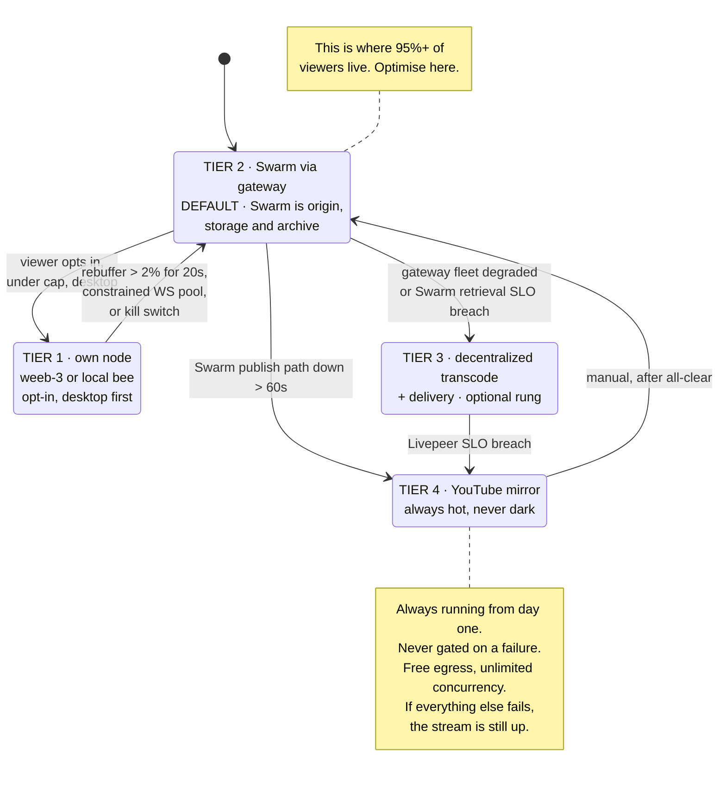

**Tier 3, Livepeer, is optional and I lean toward including it.** It gives a rung that is still decentralized before falling all the way to YouTube, which matches EF's "gradual is fine" stance better than a binary Swarm-or-YouTube switch. Devcon 6 was streamed on a decentralized transcoding network with a Swarm and IPFS archive, so there is precedent EF knows. Livepeer states it handles 1,000 concurrent streams at sub-3-second latency, and we have a `hackdays-livepeer` repo so there is prior familiarity. The reason to skip it is scope: a second integration to build and test in 14 weeks. **My call: define the rung in the design, build it only if ABR-over-Swarm lands early.**

**What the degradation ladder is now.** The *fallback tiers* are two, not four: Swarm delivery (default) and **our own standby stack** (object storage behind a second CDN). This is separate from the 4‑rendition ABR ladder in §2.3 (1080/720/480/360), which is what drives the write-side and archive volume numbers above.

### 8.5 Web2 mirror choice

| Platform | Egress cost | Concurrency ceiling | Mobile | Long-session | Verdict |
|---|---|---|---|---|---|
| **YouTube Live** | free | effectively unlimited | best | fine | **Primary mirror** |
| Twitch | free | high | good | fine | Second choice, transcode not guaranteed for non-partners |
| Kick | free | untested at this scale | ok | ok | No |
| Self-hosted CDN | $0.005 to $0.08/GB | ours to size | ours to build | fine | Defeats the purpose, adds cost |

**YouTube, and note it may already be solved for us.** If Decision 3 comes back as "EF runs their own stream too", then EF's stream *is* the mirror and our fallback is a link to it. That removes an entire integration from our scope, which is another reason to ask Decision 3 early.

**A 20-stage gotcha that only shows up at this scale: YouTube is rolling out a cap of roughly 10 concurrent live streams per channel in 2026, with enforcement still uneven.** Twenty stages therefore needs **at least two channels**, each stage with its own scheduled broadcast and stream key. Practical consequences:

- Plan for 2 to 3 channels and assign stages to them deterministically, so the run-of-show board knows where each stage is mirrored.
- **Verify the cap against the actual channels we will use, well before the event.** Uneven enforcement means we cannot assume our channel behaves like the documentation, in either direction.
- If EF publishes on Devcon's own channel, the cap applies to *their* channel and becomes their constraint to solve. Another reason to settle Decision 3 early.
- Twenty simultaneous RTMP outputs is also 20 extra encoder sessions on the media engines. Small per stream, but it is real CPU that belongs in the 150 vCPU sizing rather than discovered later.

**We build the mirror instead of renting it.** The whole of this section is moot: the standby path is now **our own segments in ordinary object storage behind a second CDN**, dormant until the signed config points at it. No YouTube, so no channel cap, no 20 extra RTMP sessions, and no platform deciding how our fallback behaves. It shares nothing with the Swarm path except the packager output, which is the property a fallback actually needs.

---

## 9. Layer 4: player

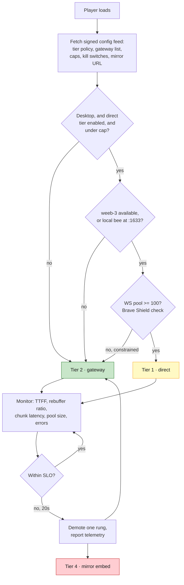

Stack, as agreed: **browser, custom hls.js plus bee client**, with weeb-3 as the in-browser node for the direct tier.

Player requirements that follow:
- Tier selection and automatic demotion, driven by the signed config feed.
- **Connection pool detection**, so a Brave Shield user silently gets the gateway instead of a degraded direct experience.
- Multi-stage switcher, since 8 to 20 parallel stages is a UX problem in its own right and is not something we have built.
- Quality selector once ABR-over-Swarm exists.
- Telemetry beacons. Non-negotiable, since without them we have no measurements and no talk.
- Privacy-clean analytics. No third-party trackers, which is both an EF expectation and a CROPS alignment point.
- Graceful "stream starting soon" and "switching paths" states. Users forgive a visible, explained switch. They do not forgive a spinner.

**Flagging honestly: the multi-stage viewer UX is unbuilt work and it is not small.** Twenty concurrent stages with a schedule, now-playing metadata and a switcher is a real frontend project. It is also the part EF's audience actually touches.

---

## 10. Layer 5: control plane

### 10.1 Pushback: do not build the app you described

You described an app that monitors all resources, dynamically starts and stops servers, notifies on costs, resources and potential attacks, with profiles and permissions, plus constant light probes and sanity checks.

**Every one of those capabilities is right, and building it as a bespoke application would be the single biggest threat to shipping in November.** That is a 3 to 6 month product competing for the same engineers who need to build ABR-over-Swarm and the multi-stage player.

**Configure the generic parts. Build only the Swarm-specific parts.**

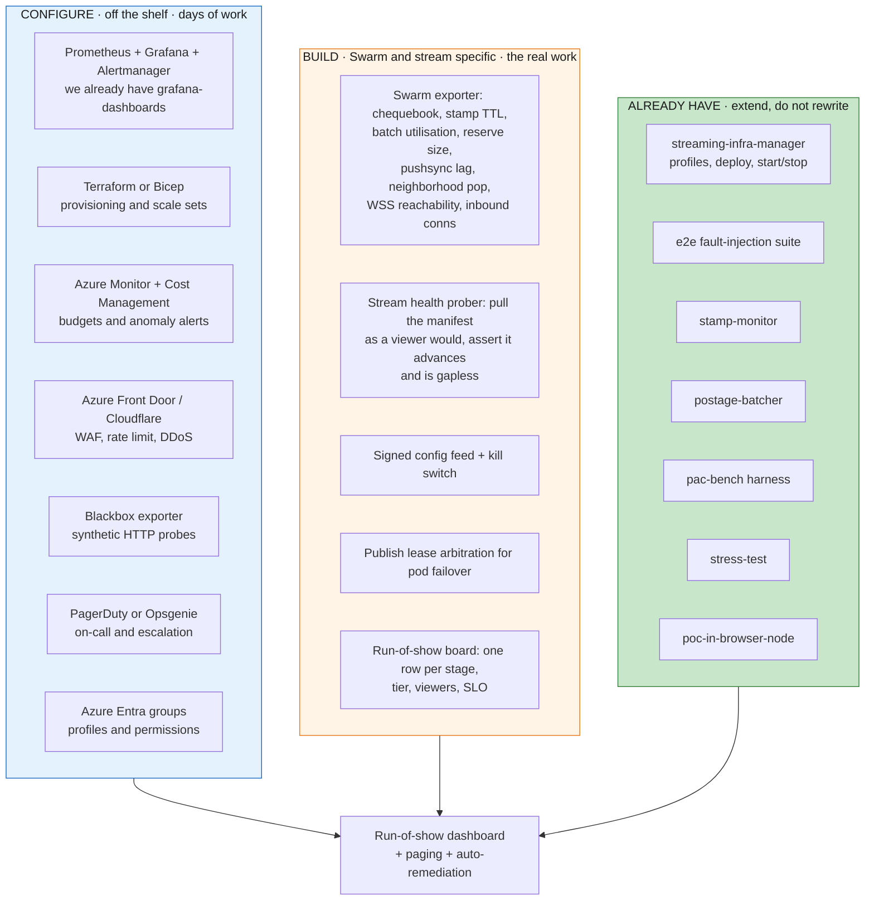

**We are further along than the meeting notes imply.** `streaming-infra-manager` already does profile-based deploys with named, port-slotted, self-contained stack deployments and a UI and API to start and stop them. That is the skeleton of "dynamically start and stop servers at will". `stamp-monitor` already watches stamp expiry from on-chain data. `postage-batcher` already does bulk batch top-ups atomically in one transaction, exactly what you want when 8 to 14 batches need funding at once. **The control plane is mostly integration work on existing pieces, not a new product.**

### 10.2 The light probes you asked about

Yes, and they are the highest-value thing in the control plane, because they measure what the viewer experiences rather than what our servers think.

| Probe | What it does | Frequency | Runs from |
|---|---|---|---|
| Manifest liveness | fetch the feed, assert the manifest index advanced | 10 s | 4 regions |
| Segment fetch | fetch the newest segment, record TTFB and total | 30 s | 4 regions |
| Gapless check | assert sequence numbers contiguous, no unexpected discontinuity | 30 s | 1 region |
| Chunk retrieval | fetch a known random chunk, record latency and hops | 60 s | 4 probe nodes |
| **Cold-cache retrieval** | fetch a chunk no gateway has cached, isolating true Swarm latency | 5 min | 4 probe nodes |
| **Browser-node playback** | headless weeb-3 session against the live feed, report TTFF and pool size | 5 min | 2 regions |
| WSS reachability scan | count mainnet nodes accepting browser dials | 15 min | control plane |
| Chequebook and stamp | balances, TTL, utilisation, per node and batch | 60 s | control plane |
| Neighborhood health | SwarmScan population for the depths we occupy | 15 min | control plane |
| End-to-end player | headless browser, real playback, TTFF and rebuffer | 5 min | 2 regions |
| Mirror liveness | assert the YouTube mirror is live and advancing | 30 s | 2 regions |

**The cold-cache probe is the subtle one and it is the most diagnostic.** If all probes fetch cached content, everything looks healthy right up to the moment cache misses spike. Deliberately probing uncached chunks is how we see Swarm's true state early. The same logic is why [8.3](#83-own-node-tier-what-we-now-actually-know) insists on re-measuring weeb-3 against live rather than well-replicated content.

### 10.3 Elasticity

- **Gateways: horizontal and automatic.** Scale on concurrent connections and egress rate, not CPU. Pre-warm before each day's first keynote rather than reacting to it.
- **Pods: manual and pre-provisioned.** Do not autoscale an ingest pod. Provision to the room list and leave it.
- **Warm fleet: scheduled.** Up the day before, down the day after. Reserve sync takes time, so bring these up days early, not hours.
- **Hard ceilings everywhere.** An autoscaler with no maximum plus a DDoS equals a budget incident. Every scale set gets a max instance count and every gateway gets an egress cap alarm.

---

## 11. Failure model

```mermaid
flowchart TB
    subgraph L0["Layer 0 · venue"]
        F1["Encoder dies"]
        F2["Venue uplink saturated or down"]
        F3["Power or human error"]
    end
    subgraph L1["Layer 1 · ingest"]
        F4["Pod VM fails"]
        F5["Media engine crash"]
        F6["Uploader crash"]
        F7["Split-brain on feed"]
    end
    subgraph L2["Layer 2 · Swarm"]
        F8["Chequebook underfunded"]
        F9["Stamp expiry or oversaturation"]
        F10["Retrieval latency spike"]
        F11["Neighborhood thin for our chunks"]
        F12["WSS entry nodes saturated"]
    end
    subgraph L3["Layer 3 · delivery"]
        F13["Gateway overload"]
        F14["DDoS"]
        F15["Direct tier overloads the network"]
    end
    F1 --> M1["Dual encoder or dual SRT out.<br/>OPEN: needs EF answer"]
    F2 --> M2["Bonded cellular second path<br/>+ local recording for the archive"]
    F3 --> M3["EF and vendor own this.<br/>Name it in the contract"]
    F4 --> M4["Standing spare takes the stage,<br/>and lane B never stopped"]
    F5 --> M5["Engine restart re-announce.<br/>PROVEN, e2e scenario E"]
    F6 --> M6["Resume from saved state,<br/>not VOD-finalise.<br/>PROVEN, e2e scenario F"]
    F7 --> M7["One writer pinned to one host.<br/>No second place it could run"]
    F8 --> M8["Preflight gate + continuous<br/>auto top-up + page"]
    F9 --> M9["stamp-monitor + postage-batcher,<br/>dilute at 85% utilisation"]
    F10 --> M10["Warm fleet, more gateway nodes,<br/>demote a tier"]
    F11 --> M11["Place our own node there.<br/>Erasure coding covers gaps"]
    F12 --> M12["Cap direct tier, add WSS nodes,<br/>raise connection limits"]
    F13 --> M13["Autoscale on connections,<br/>pre-warm before keynotes"]
    F14 --> M14["Front Door or Cloudflare,<br/>rate limits, allowlist"]
    F15 --> M15["Percentage cap + kill switch<br/>under 30 seconds"]
    style L0 fill:#ffcdd2,stroke:#c62828,color:#1a1a1a
    style L1 fill:#fff4e6,stroke:#e8730f,color:#1a1a1a
    style L2 fill:#e8f5e9,stroke:#2e7d32,color:#1a1a1a
    style L3 fill:#e3f2fd,stroke:#1565c0,color:#1a1a1a
```

**Read the mitigation column carefully.** Two say PROVEN, because the `e2e` suite actually injects those faults against a real stack. Two say OPEN and depend on EF. The rest are design intent we have not tested at 20 stages for 12 hours. **The gap between "designed" and "proven" is the entire content of the next 8 weeks.**

### 11.1 What we have already proven

From `streaming-infra-manager/e2e`, running against the real stack with `docker stop/pause` fault injection:

| Scenario | Proven behaviour |
|---|---|
| Bee frozen under 15 s | buffers, zero loss, no discontinuity |
| Bee crash over 15 s | arms a discontinuity, gap, clean resume |
| Uploader hard-crash, SIGKILL | recovers from saved state, stays live, not wrongly VOD-ed |
| Media engine restart | orchestrator re-announces, fresh live topic resumes |
| Viewer gateway down | uploads completely unaffected, independent path |
| Clean broadcaster stop | immediate VOD finalise |
| Happy path | gapless segments, advancing manifest |

A genuinely strong fault-injection story, and the best evidence that a yes is defensible. **What it does not cover: concurrency.** Every one of these is single-stream. The 8 week plan is mostly about turning this into a multi-stage, multi-hour, many-viewer version of itself.

---

## 12. Threat model

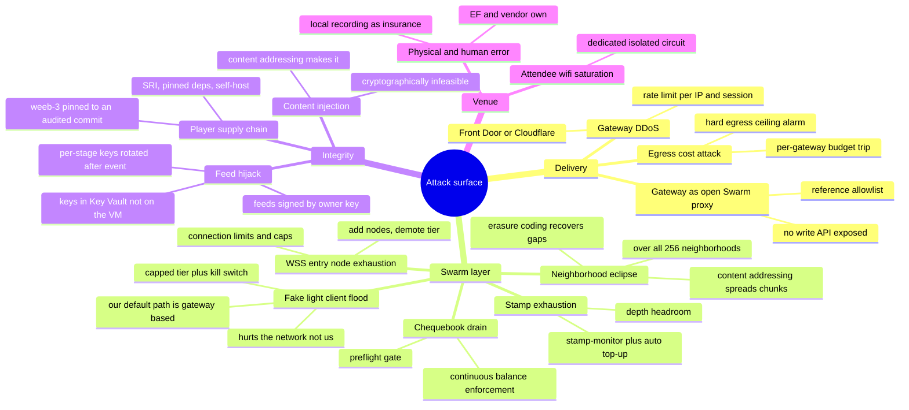

### 12.1 The two threats worth extra words

**Neighborhood eclipse is much weaker than it sounds, and this is a genuine strength of the design.** An attacker wanting to censor our stream would need to dominate the neighborhoods holding our chunks. But chunk addresses derive from content, so consecutive segments scatter across the whole address space. Blocking one neighborhood blocks roughly 1 in 256 chunks, and MEDIUM erasure coding reconstructs from missing chunks anyway. **To censor the stream you would need to capture a large fraction of the entire network, not a corner of it.** That is exactly the censorship-resistance claim, and unlike most such claims it holds up under a concrete attack model. Worth saying to EF, because it is the one property no web2 CDN can offer.

**The malicious-client threat is real but it points away from us.** An attacker spinning 20,000 fake browser nodes would degrade the *public Swarm network*, not our gateway path. Our viewers would be fine. But we would have handed them a template for stressing Swarm, and the reputational damage lands on Swarm. Which is another argument for the capped, instrumented, kill-switchable direct tier: **we should be the ones who discover Swarm's live-streaming load ceiling, carefully, before someone else discovers it carelessly.** The WSS reachability scan in [7.4](#74-the-connection-ceiling-which-is-the-newer-and-sharper-constraint) is part of that, since it tells us how small the attack surface currently is.

---

## 13. Cost model

Azure first, since that is what you asked for, then a provider comparison in [13.3](#133-provider-comparison-the-same-egress-priced-seven-ways) and four deployment variants in [13.4](#134-four-deployment-variants-priced-and-scored).

All figures are pay-as-you-go list price, no reservations or credits. Azure Central India sits in **Zone 2** for bandwidth: $0.12/GB for the first 10 TB per month, $0.085/GB for 10 to 50 TB, $0.082/GB for 50 to 150 TB, $0.08/GB above 150 TB, first 100 GB free.

### 13.1 Egress, the number that decides feasibility

Modelled over 48 live hours, average concurrency at 45% of peak, average delivered bitrate 2.2 Mbps.

| Peak concurrent | Avg concurrent | Aggregate | Egress | **Azure cost** | Effective $/GB |
|---|---|---|---|---|---|
| 4,000, EF's expected peak | 1,800 | 4.0 Gbps | 85.5 TB | **$7,506** | $0.088 |
| 10,000 | 4,500 | 9.9 Gbps | 213.8 TB | **$17,899** | $0.084 |
| 20,000 | 9,000 | 19.8 Gbps | 427.7 TB | **$35,006** | $0.082 |
| **40,000, the design ceiling** | 18,000 | 39.6 Gbps | **855.4 TB** | **$69,221** | $0.081 |

**Egress does not depend on stage count.** It depends on how many people watch. Worth internalising, because it decouples the two big unknowns: stage count drives our build effort, concurrency drives our bill.

Note also that **every viewer we move to the direct tier is egress we do not pay for.** At $0.084/GB, shifting 10% of a 10k-peak audience off our gateways saves roughly $1,800. That is a real secondary benefit of the weeb-3 work, though it should never be the reason we ship it.

### 13.2 Everything else

| Line | 8 stages | 20 stages | Note |
|---|---|---|---|
| Transcode compute, event live window only | $85 | $234 | 22 machines at 20 stages, 48 h |
| Compute, event + rehearsal, 200 h | $355 | **$977** | **use this line** |
| Compute, full month soak, 720 h | $1,278 | $3,517 | if we soak-test for a month |
| Swarm postage, single rendition, one lane, 1 yr | $870 | $2,175 | 557 GB / 1,393 GB stored |
| Swarm postage, **4-rung ladder, two lanes, 1 yr** | $3,248 | **$8,120** | 2,081 GB / 5,201 GB stamped |
| Gateway VMs, 8 to 12, event + rehearsal | ~$1,400 | ~$1,400 | placeholder, see below |
| Warm fleet, 32 nodes on 4 VMs, 1 month | ~$700 | ~$700 | placeholder, see below |
| Control plane, monitoring, probes | ~$500 | ~$500 | mostly managed services |

**The delivery fleet is the one line in this model that is not yet real.** Those two placeholder rows total $2,100 and describe 8 to 12 shared gateways plus a 32 node warm fleet. The design is **640 prefetch nodes on about 80 machines**, which on Azure at 200 hours is roughly **$7,100 of compute before disks**, and disks are not trivial for a node doing reserve sync. Pricing it properly is a decision about where those nodes live rather than an arithmetic exercise, and [13.5](#135-where-each-workload-should-actually-run) already argues they should not live on Azure. **Treat every all-in figure in this section as a floor until that decision is made.**

**Storage volume for the record:** 20 stages at a single 3 Mbps rendition for 48 hours is 1,296 GB raw, about 1,393 GB stored after MEDIUM erasure parity. A full **4-rung** ladder is 2,419 GB raw and **2,601 GB stored**, and stamping it on **two lanes** is **5,201 GB paid for**. At roughly $1.56 per GB per year, **the permanent decentralized archive of all of Devcon 8 costs between $870 and $8,120 a year.** That is still a remarkably good story and worth telling EF explicitly, since it continues the archive.devcon.org precedent at a price no one will argue with.

### 13.3 Provider comparison: the same egress, priced seven ways

**Azure is between 8x and 17x more expensive than every alternative for this workload.** Same traffic, same four concurrency scenarios:

| Provider | Geography | 4k peak, 85.5 TB | 10k peak, 213.8 TB | 20k peak, 427.7 TB | **40k peak, 855.4 TB** |
|---|---|---|---|---|---|
| **Azure Central India** | India | $7,506 | $17,899 | **$35,006** | **$69,221** |
| DigitalOcean Bangalore | India | $1,470 | $4,036 | $8,314 | $16,868 |
| Vultr Mumbai | India | $615 | $1,898 | **$4,037** | $8,314 |
| Hetzner Singapore | SEA | $635 | $1,661 | $3,370 | $6,789 |
| Hetzner EU, Falkenstein or Helsinki | Europe | $0 | $0 | **$203** | $665 |
| bunny.net Standard, Asia | CDN | $2,565 | $6,414 | $12,831 | $25,662 |
| bunny.net Volume, global | CDN | $428 | $1,069 | **$2,138** | **$4,277** |

Assumes 12 gateway instances so per-instance included allowances count. Rates: Azure Zone 2 tiers, Vultr $0.01/GB with 2 TB included, DigitalOcean $0.02/GB with 1 TB, Hetzner EU 1 EUR/TB with **20 TB included**, Hetzner Singapore **7.40 EUR/TB with only 0.5 TB included**, bunny Standard Asia $0.03/GB, bunny Volume $0.005/GB.

**Three things in that table surprised me and are worth calling out:**

1. **Hetzner EU is effectively free on bandwidth.** Twelve instances at 20 TB included each is 240 TB before a single euro of overage. Even the 20k scenario costs $203. But it is in Germany or Finland, roughly 150 ms from Mumbai, which is the wrong geography for an India-weighted audience.
2. **Hetzner Singapore is not the bargain people assume.** Only **0.5 TB included** versus 20 TB in the EU, and overage is **7.40 EUR/TB, over 7x the EU rate**. It is still 10x cheaper than Azure, but if someone in the team says "just use Hetzner", they are probably picturing EU pricing.
3. **Hetzner raised prices 30 to 35% across the portfolio on 1 April 2026.** Any quote or spreadsheet older than that is stale.

### 13.4 Four deployment variants, priced and scored

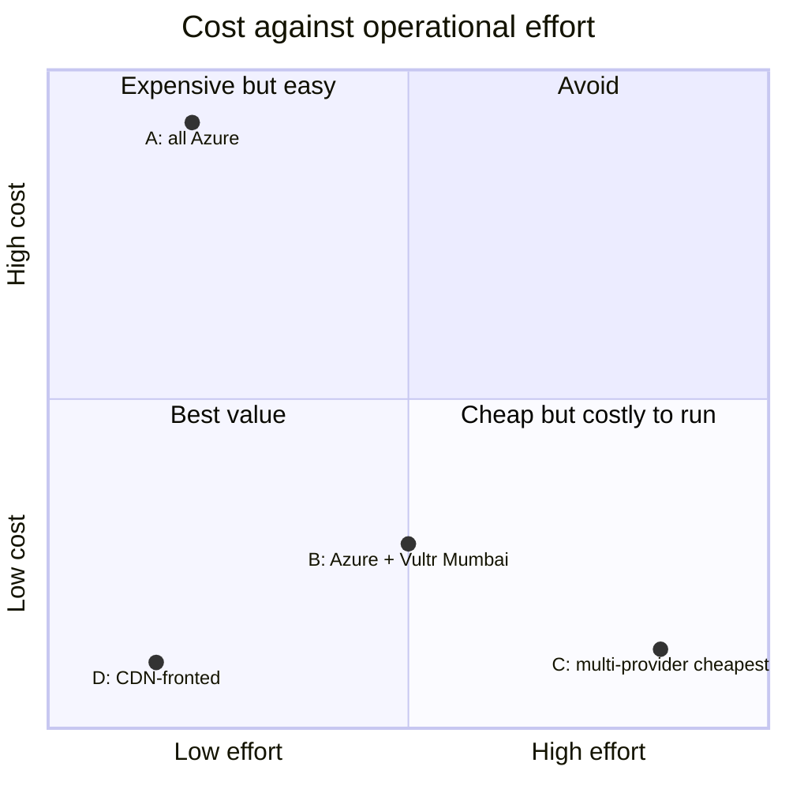

#### Variant A: all Azure

| | |
|---|---|
| **Egress, 20k peak** | $35,006 |
| **Egress, 40k peak** | **$69,221** |
| **All-in, 20 stages, 10k peak** | $29,596 |
| **All-in, 20 stages, 40k peak** | **$80,918** |
| **Extra effort vs baseline** | 0 weeks. This is the baseline. |
| **Why you would** | One vendor, one bill, one IAM model. Mature Terraform providers, Front Door for WAF and DDoS, autoscale, Azure Monitor. India region with an enterprise SLA. Fastest path to a working system. |
| **Why you would not** | It is the most expensive option by a factor of 8 to 17, and the money buys managed convenience we partly do not need. |
| **Risks** | Cost overrun if concurrency lands above plan. Egress is billed after the fact, so an unexpected 2x on viewers is an unexpected 2x on the bill with no ceiling unless we set alarms. |

#### Variant B: Azure for ingest and control, Vultr Mumbai for gateways

| | |
|---|---|
| **Egress, 20k peak** | $4,037, an 88% saving |
| **Egress, 40k peak** | $8,314 |
| **All-in, 20 stages, 10k peak** | $13,595 |
| **All-in, 20 stages, 40k peak** | $20,011 |
| **Extra effort** | **+1.5 to 2.5 engineer-weeks** |
| **What the effort is** | Vultr has no managed load balancer of Front Door's calibre, no equivalent WAF, weaker autoscale. So we build: our own HAProxy or nginx tier, our own scale-out scripts, our own image pipeline, monitoring agents on plain VMs, and a second secrets and networking domain. |
| **Why this is the pragmatic pick** | Keeps India proximity, which matters for both the venue hop and Indian viewers. Vultr has Mumbai. Saves roughly $14k at 10k peak. |
| **Risks** | Smaller provider, so less headroom if we need to burst hard. Support quality is not Azure's. **Sustained 10 to 20 Gbps of video from a low-cost VPS provider may trip unadvertised fair-use limits or abuse review**, which is the risk nobody prices in. Mitigate by talking to their sales team in advance and getting the traffic profile approved in writing. |

#### Variant C: cheapest possible, multi-provider

Azure or Vultr for ingest, Hetzner EU for the Swarm warm fleet, Vultr Mumbai plus Hetzner Singapore for gateways.

| | |
|---|---|
| **Egress, 20k peak** | roughly $2,000 to $3,500 |
| **Extra effort** | **+3 to 4 engineer-weeks** |
| **What the effort is** | Three providers means three networks, three IAM models, three secret stores, three monitoring integrations, and cross-provider private networking or mutual TLS everywhere. Failover across providers is genuinely hard. |
| **Why you would** | Absolute lowest bill. Also genuinely the most decentralized infrastructure story, which has some narrative value with EF. |
| **Why I would not, for November** | **The saving over Variant B is roughly $1,000 to $2,000. The extra effort is 1.5 to 2 engineer-weeks.** That is a bad trade when the same weeks could go into ABR-over-Swarm or the multi-stage player. Complexity is the thing most likely to make us fail, and this variant buys complexity with money we are not short of. |
| **Risks** | Highest operational risk of the four. More providers means more independent failure modes, more on-call surface, and a real chance that the person who understands one provider is asleep when it breaks. |

#### Variant D, recommended: CDN in front of a small origin

| | |
|---|---|
| **Egress, 20k peak** | **$2,451** with bunny Volume, or $13,143 with bunny Standard Asia |
| **Egress, 40k peak** | **$4,589** with bunny Volume |
| **All-in, 20 stages, 10k peak** | **$13,078** |
| **All-in, 20 stages, 40k peak** | **$16,286** |
| **Extra effort** | **+0.5 to 1 engineer-week**, the lowest of any variant |
| **Saving vs all-Azure** | **90 to 93%** with origin shield on |
| **Must not be Azure Front Door** | Front Door India egress matches raw Azure egress, so it saves nothing. bunny Volume, or another third-party CDN. |

**This is both the cheapest realistic option and the least work, which is why it is the recommendation.** A CDN is a managed service we configure, not infrastructure we operate.

**Why it works so well here specifically: content-addressed segments are immutably cacheable.** A Swarm segment's address *is* its content hash, so it can be cached forever with no revalidation. That gives a CDN a near-perfect hit rate, which collapses the origin fleet to almost nothing:

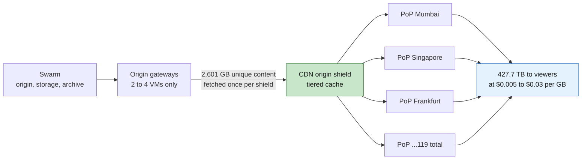

**Origin shield is the make-or-break setting.** With tiered caching the origin serves the 2,601 GB of unique content roughly once, so origin egress costs about $312 and total lands at $2,451. Without a shield, every PoP pulls every object independently, origin egress jumps to about 52 TB, and the saving drops from 93% to 81%. At bunny Standard Asia rates without a shield the saving falls to 51%. **Verify origin shield is on and measure the origin pull volume during load testing.**

**The honest architectural question: is this just a web2 CDN, which is what we said we would not do?**

No, and the distinction is real rather than a rationalisation:

| | Web2 CDN | CDN in front of Swarm |
|---|---|---|
| Origin | private server, only the operator has the bytes | **Swarm, publicly retrievable by anyone** |
| Can a viewer bypass it? | no | **yes, via any gateway or their own node** |
| Can a viewer verify the bytes? | no | **yes, the address is the content hash** |
| If the CDN removes the content? | it is gone | **it is still on Swarm and still addressable** |
| Archive | separate system | **the same chunks, permanently** |

So the CDN is a **cache, not an origin**. Swarm remains origin, storage and archive, and any viewer who distrusts the cache can fetch identical, hash-verified bytes from the network directly. That is a materially different claim from a web2 CDN and it is defensible to EF and to the Swarm community. It is also exactly the "on-ramp" and "gradual decentralization" EF said they were fine with.

**Risks specific to Variant D:**
- **Cloudflare's free tier is a trap for this workload.** Their terms restrict serving large volumes of non-HTML content on free and pro plans. Do not build a plan on 400 TB of free video egress. If Cloudflare, then a paid plan with the traffic profile agreed in advance.
- bunny.net has 119 PoPs against Cloudflare's 300-plus, so verify India PoP performance specifically rather than assuming global averages.
- The CDN sees all viewer traffic, which is a privacy and centralization point. Mitigated by publishing the gateway list in the signed config feed so we can route around, and by the direct tier existing at all.
- A CDN is one more vendor who can have a bad day. It sits above the gateway tier in the degradation ladder, so a CDN failure demotes to direct gateway access rather than going dark.

### 13.5 Where each workload should actually run

```mermaid
flowchart TB
    subgraph W1["Ingest + transcode pods"]
        A1["Needs: India proximity, reliability,<br/>predictable CPU. Egress is tiny."]
        A2["PUT ON: Azure Central India<br/>or Vultr Mumbai"]
    end
    subgraph W2["Gateway origin"]
        B1["Needs: 2 to 4 VMs only, behind a CDN.<br/>Egress collapses with origin shield."]
        B2["PUT ON: anywhere. Azure is fine<br/>at this volume."]
    end
    subgraph W3["Viewer egress"]
        C1["Needs: cheap per-GB at 85 to 428 TB,<br/>India PoP presence."]
        C2["PUT ON: bunny.net Volume,<br/>or Vultr Mumbai if no CDN"]
    end
    subgraph W4["Swarm warm fleet + WSS entry"]
        D1["Needs: cheap bandwidth, many small nodes,<br/>disk for reserve sync. Geography helps but is secondary."]
        D2["PUT ON: Hetzner EU for bulk coverage,<br/>plus a few Vultr Mumbai for India-local WSS"]
    end
    subgraph W5["Control plane"]
        E1["Needs: managed services, reliability,<br/>near-zero egress."]
        E2["PUT ON: Azure. Cost is negligible here."]
    end
    style A2 fill:#c8e6c9,stroke:#2e7d32,color:#1a1a1a
    style B2 fill:#c8e6c9,stroke:#2e7d32,color:#1a1a1a
    style C2 fill:#c8e6c9,stroke:#2e7d32,color:#1a1a1a
    style D2 fill:#c8e6c9,stroke:#2e7d32,color:#1a1a1a
    style E2 fill:#c8e6c9,stroke:#2e7d32,color:#1a1a1a
```

**The Swarm warm fleet is the one place I would definitely leave Azure regardless of which variant we pick.** A Swarm full node serves chunks to the whole network and earns BZZ at a rate far below $0.08 per GB, so **running it on Azure means paying retail cloud egress to earn cents of BZZ.** Hetzner EU at 20 TB included per instance is close to free for this, and geography matters less for coverage nodes than for gateways. Keep a handful of India-local nodes on Vultr Mumbai for the WSS entry role, where latency does matter.

### 13.6 Risk comparison across variants

| Risk | A: Azure | B: Azure + Vultr | C: multi-provider | D: CDN-fronted |
|---|---|---|---|---|
| Cost overrun | **high**, most expensive per GB | low | lowest | **lowest** |
| Operational complexity | **lowest** | medium | **highest** | **lowest** |
| Provider capacity ceiling | lowest risk | medium, VPS fair-use | medium | **lowest, CDNs are built for this** |
| Fair-use or abuse review | very low | **real, get it approved in writing** | **real, on two providers** | very low, video is the expected use |
| India latency | good | good | **compromised if EU-heavy** | **best, PoPs near viewers** |
| Failover complexity | low | medium | **high** | low |
| Weeks of extra effort | 0 | +1.5 to 2.5 | +3 to 4 | **+0.5 to 1** |
| DDoS posture | Front Door, strong | build it ourselves | build it twice | **CDN absorbs it** |

### 13.7 Recommendation

**Variant D, with Variant B as the fallback if a CDN is politically unacceptable.**

- **Viewer egress via bunny.net Volume**, origin shield on, verified against India PoPs during load testing.
- **Ingest and transcode on Azure Central India**, where reliability and proximity are worth paying for and egress is negligible anyway.
- **Origin gateways: 2 to 4 VMs**, anywhere, because a CDN with a near-perfect hit rate makes this small.
- **Swarm warm fleet on Hetzner EU** for bulk neighborhood coverage, plus a few **Vultr Mumbai** nodes for India-local WSS entry.
- **Control plane on Azure**, where cost is negligible and managed services save real time.

**Expected all-in at 20 stages and 10k peak: $13,078, against $29,596 for all-Azure. At the 40,000 ceiling: $16,286 against $80,918.** The saving is $16,518 on the event at 10k peak, rising to $64,632 at the ceiling, plus roughly $27,500 on load testing, and it costs less than one engineer-week of extra setup.

**The CDN must not be Azure Front Door.** Front Door India egress is $0.109/GB to 10 TB and $0.085/GB from 10 to 50 TB, which is the same price as serving straight off Azure VMs, so it delivers the caching, WAF and DDoS absorption but none of the saving. Above 150 TB it is quoted "contact sales", which means the 40,000 ceiling cannot be priced from published rates at all. bunny Volume at $0.005/GB is where the 93% comes from.

**Do not chase Variant C.** It saves another $1,000 to $2,000 over Variant B and costs 1.5 to 2 extra engineer-weeks, in a plan where engineer-weeks are the actual scarce resource and complexity is the main threat to shipping.

### 13.8 Two questions that could change everything

1. **Do we have Azure credits or an EF cloud sponsorship?** Many web3 orgs and most large conferences do. If we have meaningful Azure credits, Variant A becomes free and the whole comparison above is moot, so **ask this before doing any more cost work.** Note credits usually cover egress, which is exactly the expensive part.
2. **Who pays for egress?** If EF carries delivery infrastructure cost and we carry engineering, the whole feasibility question changes shape. This is questionnaire Q6 and it is now the most financially consequential open item.

### 13.9 All-in at 20 stages, the locked planning number

Costed at **20 stages, 12 h/day, 4 days, 4-rung ladder archive stamped on two lanes**. Fixed base is **$11,697** before any egress: $977 compute over 200 hours, $1,400 gateway VMs, $700 warm fleet for a month, $500 control plane, $8,120 postage for a one-year full-ladder archive on both lanes.

| 20 stages | Egress volume | A: all Azure | B: Azure + Vultr | **D: CDN-fronted** |
|---|---|---|---|---|
| 4,000 peak, EF's expectation | 85.5 TB | $19,203 | **$12,312** | $12,437 |
| 10,000 peak | 213.8 TB | $29,596 | $13,595 | **$13,078** |
| 20,000 peak | 427.7 TB | $46,703 | $15,734 | **$14,148** |
| **40,000 peak, the ceiling** | 855.4 TB | **$80,918** | $20,011 | **$16,286** |

**An honest note on the variant ranking.** At 4,000 peak, Variant B is marginally cheaper than D, by $124, because twelve Vultr instances carry 24 TB of included traffic which covers a big share of 85.5 TB. **D only wins decisively as volume grows**, by $517 at 10k, $1,586 at 20k and **$3,725 at the 40,000 ceiling**. So the case for D is not really the event bill, it is the load-testing argument below.

Excludes engineering time, on-site crew and travel.

### 13.10 The load-testing argument, which is the real reason to pick D

Three 6-hour load tests, held at peak rather than averaged:

| | Egress | Azure | CDN at $0.005/GB |
|---|---|---|---|
| 3 runs at 20k peak | 356.4 TB | **$29,304** | **$1,782** |
| 3 runs at **40k peak** | 712.8 TB | **$57,816** | **$3,564** |

**Load testing alone costs three to four times more on Azure than the entire event does under Variant D.** That is the finding that should decide this. Under Variant A we would ration load tests to protect the budget, and rationing load tests is precisely how we arrive at Gate 2 in October without the evidence to say yes. Under Variant D we can run the full stress matrix repeatedly, at the real ceiling, and still spend less than a quarter of one Azure load test.

**Cheap egress does not just save money, it buys the confidence that Gate 2 requires.** At the 20k design point the event gap between A and D is $32,555, and counting the load-test line it widens to roughly **$60,100**.

### 13.11 Funding and sponsorship options

You said we do not have credits today. Here is what is actually available, ordered by probability rather than headline value.

```mermaid
flowchart TB
    subgraph HIGH["HIGH probability · ask first"]
        A["EF or Devcon covers delivery infra<br/>as an event line item<br/>NORMAL PRACTICE · questionnaire Q6"]
        B["Swarm Foundation co-funds<br/>Mina already engaged,<br/>they gain the most from this"]
    end
    subgraph MED["MEDIUM · worth the paperwork"]
        C["Microsoft for Startups, self-service<br/>up to $5,000 Azure · no investor needed"]
        D["In-kind from bunny.net or Vultr<br/>Devcon is marquee logo placement"]
        E["EF ESP grant for the OPEN-SOURCE work<br/>$5k to $30k small, $30k to $200k standard"]
        F["Swarm Grants Programme<br/>up to 10,000 DAI in BZZ"]
    end
    subgraph LOW["LOW · long shots"]
        G["Microsoft Investor Network<br/>up to $150,000 · needs a VC referral code"]
        H["Cloudflare Project Galileo<br/>free security · public-interest mission fit"]
    end
    HIGH --> R["Most likely outcome:<br/>EF covers delivery,<br/>Swarm co-funds the R and D,<br/>MS self-service trims the rest"]
    MED --> R
    LOW --> R
    style HIGH fill:#c8e6c9,stroke:#2e7d32,color:#1a1a1a
    style MED fill:#fff9c4,stroke:#f9a825,color:#1a1a1a
    style LOW fill:#ffe0b2,stroke:#ef6c00,color:#1a1a1a
```

| Option | Value | Eligibility reality | Verdict |
|---|---|---|---|
| **EF or Devcon covers delivery infra** | up to the full $11k | Normal for events. They already carry AV, venue and connectivity. | **Ask first. This is questionnaire Q6 and the highest-probability win.** |
| **Swarm Foundation co-funds** | negotiable | They get a marquee dogfooding result and the load-test data. Mina is already in the loop. | **Ask second.** Frame as shared R and D, not a favour. |
| [Microsoft for Startups, self-service](https://learn.microsoft.com/en-us/startups/microsoft-for-startups/application) | **up to $5,000 Azure** | Privately held, for-profit, not past Series C. **No investor or accelerator needed.** Solar Punk Ltd qualifies. | **Do it this week.** It is a form, and $5,000 is a meaningful slice of an $11k budget. |
| In-kind from bunny.net or Vultr | could be most of egress | No formal programme, but "delivery for Devcon 8" is genuinely valuable placement for a challenger CDN. | **Worth a direct email.** Highest upside per hour spent. |
| [EF Ecosystem Support Program](https://esp.ethereum.foundation/funded-projects) | $5k to $30k small, $30k to $200k standard | **Must be free, open-source and non-commercial.** Event delivery is commercial, so this cannot fund the stream. It *can* fund ABR-over-Swarm, the in-browser node work, and publishing the load-test research. Q1 2026 distributed $9.856M. | **Apply, but for the tooling and research, not the event.** Do not blur the two. |
| [Swarm Grants Programme](https://www.ethswarm.org/grants/swarm-grants-programme) | up to 10,000 DAI in BZZ | Code must be open source. Developer tooling and infrastructure is an explicit category. Contact info@ethswarm.org or Discord. | **Good fit for ABR-over-Swarm or the weeb-3 integration.** Small, easy, on-mission. |
| [Microsoft Investor Network tier](https://learn.microsoft.com/en-us/startups/microsoft-for-startups/overview) | **up to $150,000 Azure** | Needs a 10-character referral code from a VC or accelerator in Microsoft's network, plus a Microsoft account with no prior Azure account. Lifetime free-credit cap is $350,000. | **Only if someone in our network has a code.** Worth one message to check. |
| [Cloudflare Project Galileo](https://www.cloudflare.com/galileo/) | free enterprise security and DDoS | For human rights, journalism, civil society and democracy organisations. Censorship-resistant streaming is a genuine mission fit, but a paid commercial partnership is a stretch. | **Apply on the censorship-resistance angle.** Free enterprise DDoS is worth the form even at low odds. |
| [Cloudflare Open Source Sponsorship](https://www.cloudflare.com/impact-portal/) | free services | Requires open source **and** operating on a non-profit basis. | Probably not, we are a Ltd doing paid work. |
| bunny.net hop.js | free CDN | **Open-source packages only, not video delivery.** | Not applicable. Do not count on it. |

**The strategic point, and I want to be blunt: do not chase a $150,000 Azure grant to pay an $81,000 Azure bill.** That is solving the wrong problem. Variant D already takes the whole event at the 40,000 ceiling to about $16,286, which is small enough that EF covering it as a line item is unremarkable and small enough that we could absorb it if we had to. **Fix the architecture first, then ask for a much smaller number.** A $16k ask succeeds where an $81k ask invites a conversation about whether the web2 alternative is cheaper.

**Recommended sequence:**
1. Ask EF who owns the delivery budget. One question, biggest lever, already in the questionnaire.
2. Ask the Swarm Foundation to co-fund the R and D half. Mina is the route in.
3. File the Microsoft for Startups self-service application. It is a form and it is worth up to $5,000.
4. Email bunny.net and Vultr about in-kind delivery for Devcon 8.
5. Prepare one ESP or Swarm Grants application covering ABR-over-Swarm, the weeb-3 integration, and publishing the load-test data. **Keep it strictly about open-source tooling and published research so the commercial engagement stays clean.**

---

## 14. Go or no-go: what must be true, by when

```mermaid
gantt
    dateFormat YYYY-MM-DD
    axisFormat %d %b
    title Path to a defensible yes

    section Decide
    EF answers on the four numbers        :crit, d1, 2026-07-30, 10d
    Budget and egress ownership settled   :crit, d2, 2026-07-30, 10d
    Internal go or no-go                  :milestone, crit, d3, 2026-08-14, 0d

    section Prove the gaps
    ABR over Swarm, uploader plus player  :crit, a1, 2026-08-15, 28d
    Multi-stage orchestration, 20 parallel :a2, 2026-08-15, 21d
    Per-stage spares and lane independence :a3, 2026-08-22, 21d
    Multi-stage player and switcher UX    :a4, 2026-08-15, 35d

    section In-browser node track
    weeb-3 against live feed, cold cache  :crit, w1, 2026-08-01, 14d
    Brave Shield 30-connection measurement :w2, 2026-08-01, 7d
    WSS-reachable mainnet node scan       :w3, 2026-08-01, 7d
    Mobile viability assessment           :w4, 2026-08-10, 14d
    Feed results to Abel, track streaming support :w5, 2026-08-15, 42d

    section Prove the scale
    Warm fleet deploy, WSS on, reserve sync :b1, 2026-09-05, 14d
    Gateway tier at 5k concurrent         :crit, b2, 2026-09-12, 14d
    Gateway tier at 20k concurrent        :crit, b3, 2026-09-26, 14d
    Direct tier ramp, 1 then 5 then 10 pct :b4, 2026-10-03, 14d
    12 hour soak, all stages              :crit, b5, 2026-10-10, 7d

    section Integrate
    Web2 mirror always-on, every stage    :c1, 2026-08-22, 14d
    Control plane and run-of-show board   :c2, 2026-09-01, 28d
    Joint rehearsal with real EF feed     :crit, c3, 2026-10-05, 5d
    Second joint rehearsal, full scale    :crit, c4, 2026-10-19, 5d
    Final commit or fall back to mirror-only :milestone, crit, c5, 2026-10-26, 0d

    section Event
    Devcon 8 Mumbai                       :crit, e1, 2026-11-03, 4d
```

### 14.1 Gate criteria

**Gate 1, mid-August, say yes or no.** All must be true:

- [ ] EF has given a stage count with a room list behind it.
- [ ] EF has given a design concurrency and a stress ceiling.
- [ ] Decision 3 answered: are we the stream, or a parallel stream?
- [ ] Decision 4 answered: desktop-to-mobile ratio.
- [ ] Egress budget owner identified, and the number is affordable to whoever owns it.
- [ ] EF confirms dual-SRT-capable encoders, or explicitly accepts single-path contribution risk.
- [ ] Two rehearsal slots with a real feed on the calendar.

**Gate 2, late October, final commit.** All must be true:

- [ ] 20 parallel streams sustained 12 hours with zero unplanned discontinuity.
- [ ] Gateway tier measured at the agreed stress concurrency.
- [ ] Web2 mirror running hot on every stage, failover exercised end to end.
- [ ] Two joint rehearsals with EF's real feed, both clean.
- [ ] Every item in [section 7.6](#76-how-we-know-when-to-add-nodes) wired to alerting with an on-call rota.
- [ ] Kill switch tested, reaching all viewers under 30 seconds.
- [ ] Direct tier either measured safe at its cap, or shipped disabled. **Either is an acceptable answer.**

**If Gate 2 fails, the fallback is not "cancel".** It is "we run the mirror as primary and the Swarm path as a visible, labelled beta". That is a much better outcome than a dark stream, and it is only available because the mirror was hot from day one. **This is the whole argument for the fallback in one sentence.**

### 14.2 What a no looks like, and why it is not a loss

EF said plainly that if we are not ready, the door is open for next year and for other EF events, because they want web3-native solutions and see Swarm as CROPS-aligned. So a no costs us this event and nothing else.

**A yes we cannot deliver costs us the relationship, and it costs Swarm's reputation at the most visible Ethereum event of the year.** Weigh accordingly. My read is that a conditional yes is right *because* the fallback ladder makes the worst case survivable, and I would be recommending a no without it.

---

## 15. Open questions

### 15.1 For EF, blocking

1. **Stage count**, with a room list. 5 to 10 or 20?
2. **Design concurrency and stress ceiling.** Total and per stage.
3. **Publishing surface.** Are we the stream on devcon.org, or a parallel decentralized stream? Does EF run their own?
4. **Desktop-to-mobile viewer ratio**, from Devcon 7 analytics if they have it. This decides whether the in-browser node tier is a headline or a footnote.
5. **Egress budget ownership.** Who pays for delivery bandwidth?
6. **Dual SRT output per stage encoder.** Yes, no, or needs an on-site relay?
7. **Two rehearsal slots with a real feed**, dates now.
8. **Latency requirement.** Is standard HLS at 10 to 15 seconds acceptable? Low latency changes the architecture materially.
9. **Cloud credits or sponsorship** available to the event?

### 15.2 For us, internal

1. **Do we have Azure credits?** Ask before modelling further. If the credits are large, Variant A becomes free and the entire provider comparison is moot.
2. **Which deployment variant?** My recommendation is D, CDN-fronted, at **$13,078 all-in against $29,596 for all-Azure at 10k peak, or $16,286 against $80,918 at the 40,000 ceiling**. **Is a CDN in front of a Swarm origin acceptable to us and to the Swarm Foundation?** The argument that it is a cache rather than an origin is in [13.4](#134-four-deployment-variants-priced-and-scored), and I think it holds, but this is a positioning call as much as a technical one and Mina should weigh in.
3. **Do we build ABR-over-Swarm, or ship a single rendition?** The biggest engineering call, and it directly affects the mobile-first audience EF named.
4. **Warm fleet: 32 nodes or 256?** And are we comfortable describing a 256 node coverage fleet honestly?
5. **How many WSS-reachable nodes exist on mainnet today?** Nobody has this number and it bounds the direct tier.
6. **Does weeb-3 hold up on a live feed with a cold cache?** Every current number is from a well-replicated VOD.
7. **Livepeer as tier 3, or a two-rung ladder?** Depends on whether ABR lands early.
8. **Who is on-call, in which timezone, for 4 days?** Mumbai is UTC+5:30. Untouched so far.
9. **What do we sign?** EF will want an uptime commitment. What number can we defend, and what is the remedy if we miss it?
10. **Where does the 640 node prefetch fleet run, and what does it cost?** The only placeholder left in the cost model, per [13.2](#132-everything-else). On Azure it is roughly $7,100 of compute before disks, and it decides whether the all-in numbers hold.

---

## Appendix A: Advanced techniques worth considering

The "alternative tricks" you asked about, ordered by how much I would actually recommend them.

### A.1 Path warming by self-prefetch: recommended

**The idea:** we run nodes distributed across the topology that fetch each new segment the moment it is published, before viewers ask for it.

**Why it works:** Swarm forwarding nodes cache what they relay. A fetch from a distant point in the topology warms every node along that path. If our warming fleet requests each new chunk from many different origins, we pre-populate caches along many paths, and the first real viewer hits a warm path instead of a cold one.

**This is the closest thing Swarm has to CDN pre-push, and it uses only existing protocol behaviour.** No Bee changes, no protocol changes. It is also cheap: warming 20 stages at 3 Mbps from 32 vantage points is 1.9 Gbps of fetch, which on included-bandwidth hosts is nearly free.

**Do this.** Low risk, no upstream dependency, and it directly attacks the cold-cache problem that is the main threat in both [7.3](#73-where-read-bandwidth-breaks-the-direct-client-number) and [8.3](#83-own-node-tier-what-we-now-actually-know). It is also the mechanism most likely to close the gap between the POC's well-replicated VOD numbers and live conditions, which makes it the highest-leverage item on the whole list.

### A.2 Neighborhood coverage fleet with WSS: recommended, partially

Covered in [7.5](#75-how-many-nodes-do-we-need-and-where). One node per depth-8 neighborhood, 256 nodes, roughly 32 VMs when packed. Mine overlay addresses into target neighborhoods, use SwarmScan's least-populated-neighborhood suggestion API to pick them, and **enable WSS on all of them** so they double as the browser entry layer.

**Start at 32 nodes covering the thinnest neighborhoods**, measure, and expand only if the probes say so. Full coverage is a decentralization compromise to make deliberately, if at all.

### A.3 Deliberate chunk placement with mined SOC ids: interesting, use sparingly

**The idea:** a single owner chunk's address derives from `hash(id, owner)`, and the `id` is arbitrary and ours to choose. So we can grind ids until a SOC lands in a neighborhood we pick. GSOC already uses exactly this mechanic.

**What it buys:** deliberately placing the hot path, manifests and newest segments, into a small set of neighborhoods where we run high-capacity, well-funded, India-local, WSS-enabled nodes. Instead of covering 256 neighborhoods we cover 8.

**What it costs:** we choose where our data lives, which is precisely the property content addressing is supposed to take away from us. The censorship-resistance argument in [12.1](#121-the-two-threats-worth-extra-words) weakens in proportion to how concentrated the placement is.

**My call:** genuinely clever, and a great research result for the talk. Use it for **manifests and feed pointers only**, where latency matters most and volume is tiny, and never for segment payloads. Keep the payload uniformly distributed so the censorship-resistance claim stays true.

### A.4 Viewer-assisted distribution: do not attempt for November

Peer-assisted delivery, where viewers serve segments to each other over WebRTC, is how commercial P2P CDNs cut egress by 60 to 90%. It would attack our largest cost directly.

**But it is a whole product.** WebRTC signalling, NAT traversal, peer selection, abuse controls. And it is a second unproven path in a plan that already has one. **Park it. Write it into the Devcon 9 pitch.** Note the in-browser node work is a genuine step toward it, since a browser that already runs a Bee node is much closer to serving peers than one that does not.

### A.5 Immutable segment caching: do this, it is free

Content-addressed segments can be cached **forever** with no revalidation, because the address *is* the content hash. A web2 HLS segment cannot make that promise. So set effectively infinite cache TTLs on segments, short TTLs on manifests only, and let every layer, gateway, CDN and browser, hold segments permanently.

A small config decision with a large effect on cache hit ratio, and a genuine architectural advantage of Swarm worth putting in the EF-facing material.

### A.6 Splice local recordings into the archive: recommended

If the contribution path drops for 90 seconds, the live stream has a gap and nothing changes that. But the on-site local recording does not. Post-event, splice it into the Swarm archive so **the permanent record is clean even where the live stream was not.**

Cheap, entirely under our control, and it means a contribution failure costs a live incident rather than a permanent hole in Devcon's archive. Worth the price of a recording box per stage on its own.

### A.7 Raise Bee cache capacity on our fleet: free, do it

Bee's cache size is configurable. On gateway-backing and warm-fleet nodes, raise `cache-capacity` substantially. These nodes exist to hold hot content and the default is tuned for a general-purpose node, not a video edge. Measure hit ratio before and after so we know what it bought.

---

## Appendix B: Sources and assumptions

### B.1 Measured, from our own work

| Source | Finding |
|---|---|
| `pac-bench` v1, June 2026 | ~1080p at 8 Mbps streamed lag-free with headroom, ceiling not reached. **Chequebook funding is the real lever, not segment size.** Retrieval is byte-bound, no per-PAC staircase. **RACE + PARANOID is a trap.** |
| `poc-in-browser-node` ([git](https://github.com/slapec93/poc-in-browser-node)) | weeb-3 4s / 2s, Vertex 6s / 2s, Hoverfly 18s / 2s against a well-replicated VOD. weeb-3 pool best at 200 stable connections. Brave Shield caps WS at 30 versus 200. Race versus normal fetch made little latency difference, no slow outlier chunks, flagged subject to change with live data. Hoverfly first to ship erasure coding plus race but its warm pool underperforms. Vertex most mature architecture. Ant and kabashira ruled out. **Selection: weeb-3**, in-house support from Abel, native streaming being added. |
| `streaming-infra-manager/e2e` | Fault-injection matrix: Bee outage short and long, uploader SIGKILL recovery, engine restart re-announce, gateway outage isolation, clean stop to VOD. All single-stream. |
| `streaming-infra-manager` | Profile-based deploy with port slots, engine choice of SRS or OME, per-profile stamps, start and stop via UI and API. |
| `swarm-hls-stream` | Pluggable engine architecture, SRS default, any HLS-producing source integrates over the HTTP API. |
| `stamp-monitor`, `postage-batcher` | Stamp expiry watching from chain, atomic bulk batch top-ups. |

Live demos: [weeb-3](https://bzz.limo/bzz/c40a2cd6c8c91f79d25e7b2b12f12413604b9a67a197990432b40adf897e8642/) · [hoverfly](https://bzz.limo/bzz/9eb1c3895f1fcc9b167b50cc217ae4479d882a42490ff1997f5b01ef2bab5df2/) · [vertex](https://bzz.limo/bzz/65a4d349e2ada2bd875f2e21d904299a20c20ef0cd9208e577a6a089f0b98e35/)

### B.2 External

- Swarm network topology, live snapshot 2026-07-29: [SwarmScan neighborhoods API](https://api.swarmscan.io/v1/network/neighborhoods). 3,143 reachable nodes, depth-8 population min 8 median 12 max 16.
- [State of the Network, January 2026](https://blog.ethswarm.org/foundation/2026/state-of-the-network-january-2026/): 4,270 reachable full nodes, 1,939 active staking nodes, 1,723 in Finland, Germany largest by reachable count at 2,332. Metrics declining month over month.
- [Bee 2.7.0 release](https://blog.ethswarm.org/foundation/2026/bee-2-7-0-release): AutoTLS and `wss://` p2p transport, **opt-in**, foundation for browser clients and WASM tooling. Multiple underlay addresses. Erasure-coding eviction fix.
- [Price oracle](https://docs.ethswarm.org/docs/concepts/incentives/price-oracle/): targets fourfold redundancy as a safe minimum, which is why depth 8 is the usable radius.
- [Bee hardware and bandwidth guidance](https://blog.ethswarm.org/foundation/2023/bee-node-hardware-requirements/): roughly 10 Mbps per node in normal operation, higher for full nodes due to constant chunk syncing.
- [Azure Zone 2 egress tiers](https://azure.microsoft.com/en-us/pricing/details/bandwidth/): $0.12/GB first 10 TB, $0.085 for 10 to 50 TB, $0.082 for 50 to 150 TB, $0.08 above, 100 GB free monthly, Central India in Zone 2. Ingress is free.
- Azure VM list pricing, from the [Azure retail prices API](https://prices.azure.com/api/retail/prices), Central India: `D16as_v5` Linux pay-as-you-go **$0.444/h**, Spot **$0.082/h**, one-year reservation $2,402/yr. `Dasv5` is linear at $0.02775 per vCPU-hour, so `D8as_v5` is $0.222/h and `D4as_v5` $0.111/h.
- [Azure Front Door pricing](https://azure.microsoft.com/en-us/pricing/details/frontdoor/): Standard $35/mo base, Premium $330/mo. **India egress $0.109/GB to 10 TB, $0.085 for 10 to 50 TB, $0.083 for 50 to 150 TB, and "contact sales" above 150 TB.** Origin-inbound in India is $0.16/GB. This is the same price as raw Azure egress, so Front Door is not the CDN that produces the Variant D saving.
- Other Azure rates, Central India: Premium SSD LRS P10 128 GB $19.71/mo, P15 256 GB $38.01, P20 512 GB $73.22, P30 1 TB $135.17. Log Analytics ingestion $3.22/GB with the first 5 GB/mo free, retention $0.14/GB/mo. Standard static public IPv4 $0.005/h.
- [Azure Media Services is retired](https://learn.microsoft.com/en-us/previous-versions/azure/media-services/latest/azure-media-services-retirement) as of 30 June 2024, so there is no managed Azure encoder and SRS on our own compute is the only path. [Azure CDN from Edgio](https://learn.microsoft.com/en-us/previous-versions/azure/cdn/edgio-retirement-faq) retired 15 January 2025 and [Azure CDN Standard from Microsoft (classic)](https://learn.microsoft.com/en-us/azure/cdn/classic-cdn-retirement-faq) retires 30 September 2027.
- [Azure penetration testing policy](https://learn.microsoft.com/en-us/azure/security/fundamentals/pen-testing): pre-approval has not been required since June 2017, and simulating high traffic load against your own application is explicitly encouraged. Denial-of-service simulation is a separate gated process. Azure runs automated abuse detection and, per the [Rules of Engagement](https://www.microsoft.com/en-us/msrc/pentest-rules-of-engagement), may interrupt a valid test at its discretion, so open a support case before the large runs.
- [Solar Punk on Swarm storage cost](https://solarpunk.buzz/understanding-decentralised-data-storage-costs-on-ethereum-swarm/): about $1.561 per GB per year at time of writing. Recheck against current BZZ price.
- Livepeer: states 1,000 concurrent streams at sub-3-second latency. Devcon 6 precedent for decentralized transcoding with a Swarm and IPFS archive.

**Alternative provider pricing, all checked 2026-07-29:**

- [Hetzner Cloud pricing](https://onedollarvps.com/pricing/hetzner-cloud-pricing): EU regions Germany and Finland include **20 TB** outbound per instance with overage at **1 EUR/TB**. US includes 1 TB. **Singapore includes only 0.5 TB with overage at 7.40 EUR/TB**, over 7x the EU rate. **Hetzner raised prices roughly 30 to 35% across the portfolio on 1 April 2026**, so older quotes are stale. No India region, Singapore is the closest at roughly 60 to 70 ms from Mumbai.
- [Vultr bandwidth](https://docs.vultr.com/support/platform/billing/what-is-the-bandwidth-overage-rate): **$0.01/GB** overage with 2 TB included per instance. **Has a Mumbai region**, which makes it the strongest India-local low-cost option.
- DigitalOcean: **$0.02/GB** overage. Bangalore region.
- [OVHcloud India](https://www.ovhcloud.com/en-in/bare-metal/dedicated-server-india/): has a **Mumbai** data centre, bare metal from 500 Mbps public bandwidth. **Caution: their unlimited-traffic promise explicitly excludes Asia-Pacific**, and APAC VPS tiers carry 1 to 4 TB monthly quotas before throttling to 10 Mbps. Verify the actual Mumbai bare-metal terms in writing before relying on it.
- [bunny.net CDN pricing](https://cdncost.com/bunnycdn-pricing): Standard Network **Asia and Oceania $0.03/GB**. Volume Network **$0.005/GB globally**, falling to $0.002/GB above 1 PB. 119 PoPs against Cloudflare's 300-plus, so verify India PoP performance specifically.
- Cloudflare: the free plan's unlimited bandwidth **does not cover this workload**. Their terms restrict serving large volumes of non-HTML content on free and pro plans. A paid plan with the traffic profile agreed in advance is the only safe route.

**Funding and platform constraints, checked 2026-07-29:**

- [Microsoft for Startups](https://learn.microsoft.com/en-us/startups/microsoft-for-startups/application): self-service path gives **up to $5,000** in Azure credits with no investor tie. The **Investor Network path gives up to $150,000** but needs a 10-character referral code from a VC or accelerator in Microsoft's network. Eligibility: privately held, for-profit, not past Series C, lifetime free-credit cap $350,000. The top tier also wants a Microsoft account with no prior Azure account.
- [Ethereum Foundation ESP](https://esp.ethereum.foundation/funded-projects): small grants $5k to $30k, standard $30k to $200k, large strategic $200k plus. **Q1 2026 distributed $9.856M.** Over 900 projects and $148M since 2019. **Requires the funded work to be free, open-source and non-commercial**, so it can fund our tooling and published research but not the commercial event delivery.
- [Swarm Grants Programme](https://www.ethswarm.org/grants/swarm-grants-programme): up to **10,000 DAI in BZZ**. Code must be open source. "Developer Tooling and Infrastructure" is an explicit category. Route in via info@ethswarm.org or the Swarm Discord.
- [Cloudflare Project Galileo](https://www.cloudflare.com/galileo/): free enterprise-grade security and DDoS protection for human rights, civil society, journalism and democracy organisations, currently protecting 2,900-plus properties. [Cloudflare's open-source sponsorship](https://www.cloudflare.com/impact-portal/) separately requires operating on a non-profit basis.
- bunny.net [hop.js](https://bunny.net/blog/introducing-hop-js-a-safe-free-cdn-for-open-source-projects-without-the-privacy-tax/) is a free CDN for **open-source packages only**, with logging disabled. It does not cover video delivery.
- YouTube concurrent live streams: **no officially published number, but a cap of roughly 10 per channel is rolling out during 2026 with uneven enforcement.** Each concurrent broadcast needs its own scheduled stream and stream key. At 20 stages this means 2 or more channels, and it must be verified against the actual channels we will use.

### B.3 Assumptions to challenge

| Assumption | Value | If wrong |
|---|---|---|
| Average concurrency is 45% of peak | 0.45 | Egress scales linearly. A 70% ratio raises the 10k case from $17.9k to $27.8k |
| Average delivered bitrate | 2.2 Mbps | Linear on egress. No ABR means everyone gets the top rung, rising toward 3.0 |
| Overlay hops per retrieval | 4 | Linear on network-wide load in 7.3. Could be 3 or 6 |
| **Forwarding-node caching absorbs the herd** | unmeasured | **The single biggest unknown in this document.** If wrong, the direct tier is unusable at any scale |
| **weeb-3 live numbers resemble its VOD numbers** | unmeasured | If live is much worse, the direct tier is desktop-enthusiast only. Test first, per 8.3 |
| **WSS-reachable node count is adequate** | unmeasured | If it is tiny, the direct tier is bounded by our own warm fleet, not by Swarm |
| Audience skews desktop enough for a direct tier | unknown | Decision 4. If 80% mobile, direct tier is a footnote |
| 48 live hours | 12 h x 4 d | Linear on everything |
| Bee packs 8 nodes per 16-core VM | 8 | Fleet VM count scales inversely |
| Swarm storage $1.561/GB/yr | BZZ-dependent | Postage is a rounding error either way |
| **CDN origin shield gives a near-perfect hit rate** | assumed | **The whole Variant D saving rests on this.** Without a shield the saving drops from 93% to 81%, and at Standard Asia rates to 51%. Measure origin pull volume during load testing |
| Unique content is 2,601 GB, 20 stages, 4-rung ladder | computed | Origin egress under Variant D scales directly with this |
| Low-cost providers tolerate sustained 10 to 20 Gbps | **unverified** | **Get the traffic profile approved in writing before committing.** An abuse-review suspension mid-event would be self-inflicted and unrecoverable |
| 12 gateway instances, so per-instance allowances count | 12 | Hetzner EU's 20 TB per instance is why that row reads $0. Fewer instances means less included traffic |
| **Both publish lanes produce byte-identical output** | assumed | It is why two lanes cost double postage and egress but add nothing to what the network stores. If the lanes ever diverge, by a transcoder version skew or a non-deterministic encoder setting, the chunk addresses diverge with them and stored volume doubles. **Pin the encoder build and settings across lanes, and assert it in a test** |
| Load tests hold at peak for the run | 100% of peak | The stress figures in [13.10](#1310-the-load-testing-argument-which-is-the-real-reason-to-pick-d) do not apply the 45% average, because a run that averages 45% is not testing the peak. This makes load-test volume 2.2x the equivalent event hours |
| **Prefetch fleet cost** | **unpriced** | The base in [13.9](#139-all-in-at-20-stages-the-locked-planning-number) carries $2,100 for 8 to 12 gateways plus a 32 node warm fleet. The design is 640 prefetch nodes on about 80 machines, roughly $7,100 of Azure compute before disks. **The largest open number in this cost model** |
| Average delivered bitrate, cross-document | 2.2 Mbps here, 3 in `arch-explorer` | Both cannot be right, and 3 Mbps is the top rung of a ladder whose bottom two rungs carry 70% of a mobile audience. Settle it in one place |

---

**Next action:** get answers to the nine blocking questions in [15.1](#151-for-ef-blocking). Nothing else can be finalised without the first four, and the budget conversation with Aron cannot start without number five.

**Parallel action that does not wait for EF:** the three measurements in [8.3](#83-own-node-tier-what-we-now-actually-know), weeb-3 against a live cold-cache feed, weeb-3 under Brave Shield, and the WSS-reachable node scan. All three are cheap, none depends on any EF answer, and together they tell us whether the direct tier is a headline or a footnote before Gate 1.
