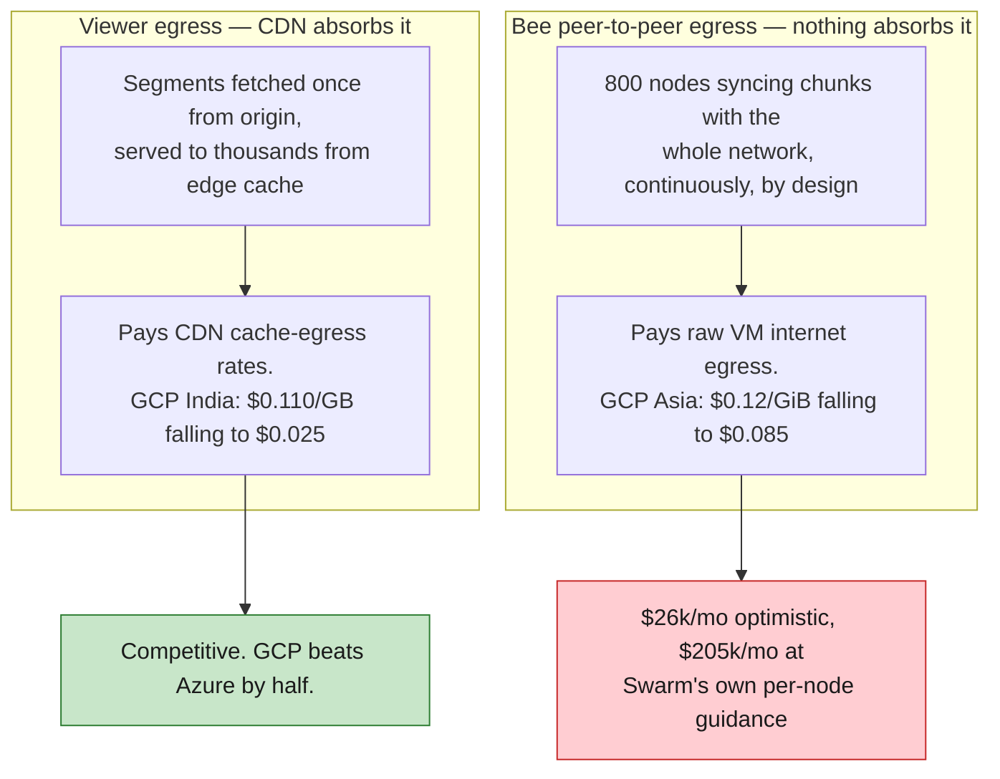
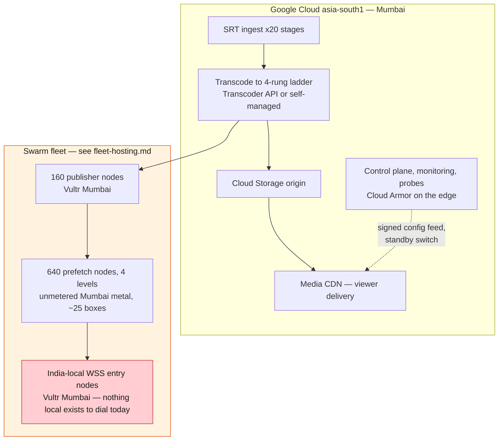

# Deploying Devcon 8 on Google Cloud and Alibaba Cloud

Provider plan for the twenty-stage architecture, scored on security, reliability, ease of
use and available components. Written 2026-08-12.

All figures are pay-as-you-go list price with no reservations, committed-use discounts or
negotiated terms. **Everything here is a starting position for a quote, not a quote.**
Volumes come from [architecture-plan.md](architecture-plan.md) §13.1 so the numbers are
comparable with the rest of the cost model.

---

## The short version

**Google Cloud can carry most of this architecture and Alibaba Cloud cannot carry the part
that matters most.** Two facts decide it before any scoring:

1. **Alibaba Cloud has no India region.** The Mumbai region `ap-south-1` stopped accepting
   new purchases on 31 March 2024 and ceased service on 15 July 2024, with customers
   migrated to Singapore. India proximity is the requirement that drove every earlier
   provider decision, for a conference in Mumbai. The nearest Alibaba capacity is Singapore,
   roughly 3,900 km away.
2. **Neither provider can host the Swarm fleet.** Bee node traffic is peer-to-peer, so no
   CDN can absorb it and it pays raw VM internet egress. At the fleet's optimistic traffic
   estimate that is **about $26,000 a month on either provider**, and at Swarm's own
   guidance it is **about $205,000**. This is the same wall that ruled out Azure and AWS,
   and it is not a negotiating position, it is arithmetic.

So the recommendation is a split, not a winner:

| Workload | Where it goes | Why |
|---|---|---|
| Ingest, transcode, packaging | **GCP `asia-south1` (Mumbai)** | India proximity, Live Stream and Transcoder APIs both available there, egress is negligible |
| Viewer delivery | **GCP Media CDN** | $34,485 at the 40,000 ceiling against Azure's $69,232, and it is a real video product rather than a general load balancer |
| Control plane, monitoring, probes | **GCP `asia-south1`** | managed services, near-zero egress, one IAM domain to reason about |
| **Swarm publisher and prefetch fleet** | **neither — see [fleet-hosting.md](fleet-hosting.md)** | [the egress wall](#the-egress-wall) makes metered per-GB pricing unaffordable here. Unmetered bare metal in Mumbai carries the same fleet for **about $7,500 a month at any throughput**, with the India-local tier on Vultr |

**Alibaba Cloud is not recommended in any role.** It loses the geography outright, and its
only structural advantage over GCP is a marginally cheaper flat egress rate that the
architecture cannot exploit.

**The fleet has a costed answer and it is not on either provider.**
[fleet-hosting.md](fleet-hosting.md) prices five hosting shapes against the same traffic model
and lands on a split: bulk coverage nodes on unmetered Mumbai bare metal, India-local WSS entry
and publisher nodes on Vultr Mumbai. That is **$7,500 against $63,205 on GCP** at the
optimistic estimate, and the gap widens to 34x at Swarm's own. It is the single largest saving
available anywhere in this document.

---

## The egress wall

The architecture has two traffic classes and they price completely differently. Conflating
them is the error that makes hyperscaler quotes look survivable.

### Viewer egress, where GCP is genuinely good

Volumes from §13.1, modelled over 48 live hours at 45% average concurrency and 2.2 Mbps
average delivered bitrate.

| Peak concurrent | Volume | **GCP Media CDN** | Alibaba Singapore | Azure, for reference |
|---|---|---|---|---|
| 4,000, EF's expected peak | 85.5 TB | **$6,762** | $5,194 | $7,511 |
| 10,000 | 213.8 TB | **$14,152** | $12,988 | $17,904 |
| 20,000 | 427.7 TB | **$22,708** | $25,983 | $35,016 |
| **40,000, the design ceiling** | 855.4 TB | **$34,485** | $51,966 | $69,232 |

GCP's India edge rate starts at $0.110/GB and falls to $0.025/GB above 500 TB, which is why
it pulls ahead as volume grows and ends up at **half the Azure figure** at the ceiling. The
Alibaba column is Singapore VM egress at $0.081/GB with a 25% prepaid data-transfer bundle,
because their CDN is quote-only; it wins at low volume purely by being flat-rated and loses
badly once GCP's volume tiers engage.

### Bee peer-to-peer egress, where both providers fail

Twenty stages at four rungs on two lanes is 160 feeds. One publisher node writes each feed,
and the four-level prefetch placement puts 640 more nodes behind them. **800 Bee nodes**,
each one talking to the rest of the network whether or not anyone is watching.

| Per-node sustained | Fleet volume, full month | **GCP VM egress** | Alibaba Singapore | Alibaba, 25% bundle |
|---|---|---|---|---|
| 1.0 Mbps, optimistic | 259 TB | $20,785 | $20,995 | $15,746 |
| 1.25 Mbps, current costing midpoint | 324 TB | **$25,915** | $26,244 | $19,683 |
| **10 Mbps, Swarm's own guidance** | 2,592 TB | **$205,455** | $209,952 | $157,464 |

Restricted to the event and rehearsal window of 200 hours rather than a full month, the same
three rows are $5,966 / $7,391 / $57,263 on GCP. **That window is the wrong way to plan it**
— prefetch nodes have to be warm and reserve-synced well before anyone streams, so the
monthly figure is the honest one.

**The fleet's own chatter outruns every viewer in the model.** At the 1.25 Mbps midpoint the
nodes cost more in egress than 40,000 concurrent viewers do. That is the whole reason the
fleet cannot live on metered per-GB pricing, on these two providers or any other in their
class.

### The way out is to stop paying per GB

An unmetered port removes this line from the bill entirely. 800 nodes at even the pessimistic
10 Mbps is 8 Gbps aggregate, which spread across 25 bare-metal boxes is 320 Mbps each —
comfortably inside a 1 Gbps unmetered port. Bare metal in Mumbai with such a port runs about
$7,500 a month for the whole fleet, **and costs the same whatever the per-node figure turns out
to be**.

[fleet-hosting.md](fleet-hosting.md) works this through against five hosting shapes and two
packing densities. Its conclusions in brief: Vultr remains the best *metered* option at $9,515
and is the right home for the India-local tier; unmetered metal is the right home for the bulk
coverage fleet; and the plan's assumption of 8 nodes per machine costs more than the choice of
provider does, because 32 nodes fit on one box and disk binds before CPU.

### The number that decides this is still unmeasured

The spread between $20,785 and $205,455 is a single unmeasured constant: sustained
per-node peer-to-peer throughput. The costing carries 1.0 to 1.5 Mbps; Swarm's own guidance
for a full node doing constant chunk syncing is nearer 10 Mbps. **Two nodes instrumented for
a week settles it**, using [../tools/bee-egress/](../tools/bee-egress/). It is the cheapest
item on the list and it moves the twenty-stage bill more than anything else in this document.

**This is also the strongest argument for the unmetered shape.** Every metered option swings by
2x to 4x on a number we do not have, so choosing one now is a bet on the measurement. An
unmetered port is the same price either way, which buys certainty rather than the theoretical
minimum — worth having with the event in November.

---

## Why India presence is not negotiable

The four-level prefetch fleet is not only a cache. Per [architecture-plan.md](architecture-plan.md)
§7.4 it is also the **WSS entry layer** that makes in-browser nodes possible at all, because
browsers can only dial nodes that speak `wss://`.

A scan of mainnet on 2026-08-12 measured this directly, and the result sharpens the
requirement rather than relaxing it. Of 4,706 nodes visible, **2,065 are genuinely
WSS-reachable** — verified by completing a real WebSocket upgrade against each one, not by
trusting the advertised address. That is far better coverage than the plan assumed. But:

- **Zero of them are in India.** None anywhere in Asia.
- **1,231 are in Germany**, and 2,045 of the 2,065 sit inside three IP ranges belonging to a
  single hosting company. The browser-dialable Swarm network is effectively one provider's
  German network.

Full method and figures in [measurements/wss-reachability.md](measurements/wss-reachability.md).

Two consequences for this decision. First, **a browser node in Mumbai today has nothing
local to dial**, so the India-local WSS entry role has to be ours to fill and it needs to be
in India. Second, the direct tier currently rests on one autonomous system in the wrong
hemisphere, which is a concentration risk worth naming even though it is not ours to fix.

This is what rules Alibaba Cloud out rather than merely marking it down. Singapore is
roughly 40 ms from Mumbai on a good path, against 2 to 5 ms in-region, and the direct tier
is retrieving 2-second segments over a connection pool that is already the binding
constraint.

---

## Component mapping

What each piece of the architecture would actually run on.

| Architecture component | Google Cloud | Alibaba Cloud |
|---|---|---|
| SRT / RTMP ingest | Compute Engine in `asia-south1`, or **Live Stream API** input endpoints | ECS in Singapore, or **ApsaraVideo Live** ingest |
| Transcode to a 4-rung ladder | **Transcoder API** (available `asia-south1`), or self-managed ffmpeg on C4/N4 instances | **ApsaraVideo** media transcoding, or self-managed on ECS |
| HLS packaging and manifests | Live Stream API output, or self-managed | ApsaraVideo Live, or self-managed |
| Origin storage | Cloud Storage, `asia-south1` bucket | OSS, Singapore bucket |
| Viewer delivery CDN | **Media CDN** — built on Google's video-serving edge | Alibaba CDN / DCDN, quote-only pricing |
| Swarm publisher nodes | **Do not place here** — see the egress wall. Vultr Mumbai instead | **Do not place here** |
| Swarm prefetch fleet, 640 nodes | **Do not place here** — unmetered Mumbai metal instead | **Do not place here** |
| India-local WSS entry nodes | technically fits `asia-south1`, but pays VM egress. Vultr Mumbai instead | **no India region at all** |
| Container orchestration | GKE, Autopilot or Standard | ACK |
| DDoS and WAF | **Cloud Armor**, integrated with the load balancer | **Anti-DDoS** (Basic free, Pro/Premium paid) + WAF |
| Secret management | Secret Manager | KMS Secrets Manager |
| Metrics, logs, alerting | Cloud Monitoring and Logging | CloudMonitor, Log Service |
| Infrastructure as code | `hashicorp/google` v7.44.0 | `aliyun/alicloud` v2.0.0-beta2 |

**The two managed-media products are worth a serious look on GCP.** Live Stream API and
Transcoder API are both available in `asia-south1`, and between them they remove the
transcode fleet from our operational surface entirely. That is a real reduction in what we
have to build and run, and it is the strongest argument for GCP beyond price. It is also a
lock-in decision, and it does not help the Swarm side of the architecture at all.

Note one gap: **Live Stream API is not available in `asia-south2` (Delhi)**. Mumbai is the
only Indian region that can run the managed path, so the region choice is made for us.

---

## Scored on the four axes

### Security

| | Google Cloud | Alibaba Cloud |
|---|---|---|
| DDoS | Cloud Armor, always-on L3/L4 with managed WAF rules and adaptive protection | Anti-DDoS Basic included; meaningful protection needs paid Pro or Premium |
| Identity | IAM with workload identity federation, service accounts, org policy constraints | RAM, capable but coarser; org-level policy is thinner |
| Network isolation | VPC Service Controls, Private Service Connect | VPC, security groups, no close equivalent to VPC Service Controls |
| Secrets | Secret Manager with IAM-native access control and rotation | KMS Secrets Manager |
| Encryption | default at rest, CMEK and CSEK available | default at rest, BYOK available |
| Compliance posture for an EU-facing partner | mature, familiar to EF's own auditors | operationally separate China and International entities, and a data-governance conversation nobody on this project wants to have in October |

**GCP wins clearly.** Cloud Armor being integrated with the load balancer matters
specifically here, because the kill-switch and rate-limiting requirements in the plan's
threat model become configuration rather than something we build.

### Reliability

| | Google Cloud | Alibaba Cloud |
|---|---|---|
| India regions | `asia-south1` Mumbai (3 zones), `asia-south2` Delhi (3 zones) | **none** |
| Nearest usable region | in-country | Singapore, ~3,900 km |
| Compute SLA | 99.99% multi-zone, 99.9% single instance | 99.975% multi-zone ECS, 99.95% single |
| Regional escape hatch | second Indian region for control-plane failover | Singapore to Jakarta, both far from the venue |
| Track record on this workload class | Media CDN serves YouTube-scale video | ApsaraVideo is proven, largely in China |
| Provider-exit risk | low | **demonstrated** — India and Australia were both closed at 3 months' notice in 2024 |

**GCP wins, and the last row is the one that should carry weight.** A provider that exited
India on short notice is a poor foundation for a commitment to a partner whose event is in
India, regardless of how good the Singapore region is.

### Ease of use

| | Google Cloud | Alibaba Cloud |
|---|---|---|
| Terraform resources | 1,150 resources, 495 data sources, 20 guides | 1,167 resources, 766 data sources, 3 guides |
| Terraform maturity | **v7.44.0 stable**, released 2026-08-11, 2.3B downloads | **v2.0.0-beta2**, a beta major, 66M downloads |
| Documentation | comprehensive English | English and Simplified Chinese; parts of the technical corpus are Chinese-only |
| Managed media path | Live Stream API plus Transcoder API, both in-region | ApsaraVideo Live, documentation thinner in English |
| Team familiarity | conventional hyperscaler idiom | new idiom to learn, on a deadline |
| Support ecosystem | large third-party community | small outside China |

**Raw Terraform coverage is a genuine tie** — alicloud actually exposes slightly more
resources. The gap is maturity and ecosystem, not breadth: pinning infrastructure for a
one-shot live event to a provider whose current Terraform major version is a beta is a risk
with no upside, and 3 guides against 20 is what that difference feels like in practice.

### Available components

Both providers cover the whole pipeline on paper. The differences that matter:

- **GCP has a purpose-built managed live path in Mumbai.** Live Stream API and Transcoder
  API in `asia-south1` can replace the transcode pods outright.
- **GCP's CDN is a video CDN.** Media CDN runs on the edge that serves YouTube, and its
  India rate card falls to $0.025/GB at volume.
- **Alibaba's equivalents are all offshore for this event.** ApsaraVideo Live and Alibaba
  CDN are capable products; none of them can be placed in India.
- **Neither provider has anything for the Swarm tier.** This is not a components gap either
  of them can close. Bee nodes want cheap sustained bandwidth and a lot of small instances
  with disk, which is the opposite of what hyperscaler pricing is shaped for.

### Scorecard

| Axis | Google Cloud | Alibaba Cloud |
|---|---|---|
| Security | **strong** | adequate, plus a governance conversation |
| Reliability | **strong** | capable, but no India region and a demonstrated exit |
| Ease of use | **strong** | workable, beta Terraform, thinner English docs |
| Available components | **strong for web2, nothing for Swarm** | **offshore for web2, nothing for Swarm** |
| Viewer egress cost | competitive, beats Azure by half at the ceiling | cheaper at low volume, worse at the ceiling |
| Swarm fleet cost | **unaffordable** | **unaffordable** |

---

## Recommended deployment

**Phase it.** The web2 half can be built on GCP now, because ingest, transcode, delivery and
control plane are all well served in `asia-south1` and none of them is blocked on the
unmeasured egress constant.

The Swarm half is costed in [fleet-hosting.md](fleet-hosting.md) and its recommendation is
deliberately the shape that survives the measurement either way, so it does not have to wait
for it. What the measurement still decides is whether the four-level placement is affordable at
all and whether 25 boxes is the right count — not which provider to talk to.

---

## What to get quoted, and what to measure

Ordered by how much each one moves the decision.

1. **Measure sustained Bee peer-to-peer egress on two nodes for a week**, with
   [../tools/bee-egress/](../tools/bee-egress/). The spread it resolves is $20,785 to $205,455
   a month. No external dependency.
2. **Test packing density on one box for one day.** 32 Bee nodes through a full reserve sync.
   Settles a 4x range on fleet compute, and it is the cheapest test on this list. See
   [fleet-hosting.md](fleet-hosting.md).
3. **Get the fair-use number in writing from the unmetered hosts**, and a written workload
   confirmation from whoever hosts the fleet. Sustained multi-gigabit traffic alongside hundreds
   of long-lived peer-to-peer connections is an unusual profile, and "unmetered" often carries
   an unpublished cap. An abuse or fair-use review during the event is unrecoverable.
4. **Quote GCP Media CDN with committed use.** The list-price figures above are the ceiling.
   At 855 TB there is real room, and the $34,485 line is the one worth negotiating.
5. **Quote Vultr Mumbai for the India-local tier**, roughly 200 nodes across `bom`, `blr` and
   `del`, per [fleet-hosting.md](fleet-hosting.md).
6. **Confirm GCP Standard Tier egress rates for `asia-south1`.** Standard Tier is cheaper
   than the Premium figures used here and may suit the fleet's WSS entry nodes, where
   Google's premium backbone buys us nothing.
7. **Price the 640-node prefetch fleet's disks.** Reserve sync is disk-heavy and every
   compute figure in this document excludes storage.

---

## Risks

| Risk | Severity | Mitigation |
|---|---|---|
| Per-node P2P egress lands near 10 Mbps | **critical** | measure it this week; the unmetered fleet shape in [fleet-hosting.md](fleet-hosting.md) is priced to absorb it, but the four-level placement may still need rethinking |
| "Unmetered" turns out to carry a fair-use cap | **high** | get the number in writing before ordering; if they will not give one, treat the port as metered and fall back to Vultr's $0.01/GB |
| Unmetered hosts are smaller companies with thinner support | medium | keep them to bulk coverage nodes, whose failure mode is a colder cache; the latency-critical India tier stays on Vultr |
| Managed media lock-in | medium | keep the self-managed ffmpeg path working in parallel; the ladder is ours either way |
| No India-local WSS nodes exist but ours | medium | this is already the plan's assumption; the scan confirms it rather than changing it |
| Media CDN committed-use terms outlast the event | low | negotiate a 1-month or event-scoped commitment |
| GCP egress rates move before November | low | Google published a peering-rate change effective 1 May 2026; re-check before signing |

---

## What this supersedes

This document replaces the Vultr-and-CDN provider position for planning purposes, following
the decision on 2026-08-12 to plan with Google Cloud and Alibaba Cloud instead. The
workload-placement guidance in [architecture-plan.md](architecture-plan.md) §13.3 and §13.5
still reflects the earlier provider set and needs a follow-up pass to match this document;
until then, treat this file as current on provider choice and the plan as current on
everything else.
