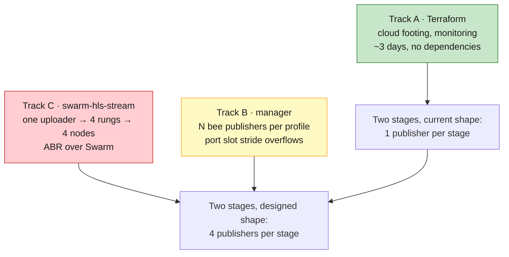
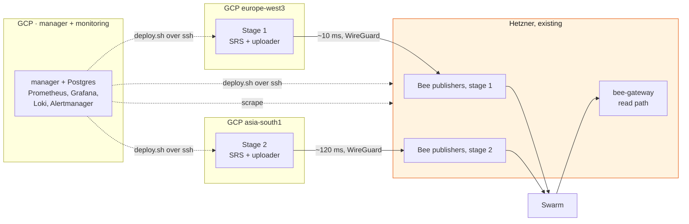

# Rolling out two stages with Terraform

Provisioning plan for the first real deployment: **two stages, one lane, no backup uploaders**,
on Google Cloud with the Bee publishers on our existing Hetzner machines. Written 2026-08-14,
following the decision on 2026-08-12 to plan with Google Cloud
([feasibility/gcp-alibaba-deployment.md](../feasibility/gcp-alibaba-deployment.md)).

One stage is `SRS → stream-uploader → 4 Bee publishers`, one per rung. Two stages is that
twice, plus the monitoring stack. Nothing else from the twenty-stage architecture is in scope:
no lane B, no standing spares, no prefetch fleet, no CDN, no standby stack.

---

## The short version

**Terraform is not what stands between us and two stages, and the plan should not pretend it
is.** Reading `streaming-infra-manager` changes the shape of this rollout in two ways:

1. **Most of what a first pass would put in Terraform already exists, one layer down.**
   `swarm-hls-stream/deploy/scripts/deploy.sh` already takes a per-service host map, allocates
   ports from a slot number, renders per-profile env files, and deploys over SSH. The manager
   already owns profiles, stamps and container lifecycle. Terraform rendering Bee compose files
   would be rebuilding a seam that is already there and already tested.
2. **The publish path we are describing does not exist yet.** A profile today deploys **one**
   `bee-uploader` and one `bee-gateway`. Four publishers per stage, one per rung, needs work in
   the manager and in `swarm-hls-stream` — and that work, not the cloud footing, is the critical
   path.

So Terraform's job is small, well-bounded and worth doing now anyway:

| | Owner |
|---|---|
| Machines, network, firewalls, addresses, secrets, monitoring host | **Terraform** |
| `config.json`, `manager/.env`, base `.env`, SSH aliases, Prometheus targets | **Terraform renders, applier pushes** |
| Profiles, port slots, per-profile env, Bee data dirs, containers | **the manager** |
| Postage batches | **the manager** — `StampService` already does this |
| Chequebook funding, signing keys, the Hetzner machines themselves | **nobody automates these** |

**The one rule that keeps this honest: Terraform must never learn how many Bee nodes a stage
has.** If `rungs` appears anywhere in the HCL, the per-rung work in tracks B and C will force a
Terraform rewrite. If Terraform only knows about *hosts*, that work lands underneath it and
changes nothing.

---

## What "two stages" is, concretely

### Google Cloud, existing project

| Resource | Count | Note |
|---|---|---|
| VPC + subnets | 1 + 2 | one subnet per region; not the default network |
| Stage host | 2 | ~8 vCPU each — SRS + `stream-uploader` per stage |
| Manager + monitoring host | 1 | ~4 vCPU, separate persistent disk for the TSDB |
| Static external IP | 2 | the floating SRT address per stage. This is the value the encoder is configured with, and it has to outlive the VM |
| Firewall rule | 4 | SRT UDP from test/venue sources only; IAP-range SSH; WireGuard; monitoring → stage scrape |
| Service account | 3 | stage, monitoring, deployer. Never the default SA |
| Secret Manager secret | ~8 | SRT passphrases, `POSTGRES_PASSWORD`, Bee node passwords, WireGuard keys, Grafana admin |
| GCS bucket | 1 | Terraform state, versioned |

### Hetzner, existing machines, not managed by Terraform

8 `bee-uploader` containers, one per rung per stage, placed by `config.json`. Plus
`node_exporter` per host and one WireGuard peer per host.

### The read path is already in the box

The profile model ships a `bee-gateway` (swap disabled, cache-capacity configurable) and a
`client` whose nginx proxies `/bee` to it. So verifying a publish needs no new component and no
public gateway: deploy `bee-gateway` on the Hetzner side of one stage and read through it. A
public gateway is still useful as a second opinion, precisely because it is not ours.

---

## Where Terraform's job ends

The seam is `deploy/config.json`, and it already exists:

```json
{
  "services": {
    "srs":             "stage1-fra",
    "stream-uploader": "stage1-fra",
    "bee-uploader":    "hetzner-1",
    "bee-gateway":     "hetzner-1",
    "client":          false
  }
}
```

`deploy.sh` reads that map, syncs each service to its target over SSH, and **auto-resolves
`BEE_URL` and the `*_ADAPTER_HOST` keys from where each service landed**. That is exactly the
cross-provider split we want, and it is a data file rather than a feature to build.

So Terraform's rendered output is short:

| Rendered file | Consumed by |
|---|---|
| `deploy/config.json` | `deploy.sh` — service → host placement |
| `~/.ssh/config` fragment | `deploy.sh`, `deploy/deploy.sh` — both take ssh aliases |
| `manager/.env` | the manager's compose stack |
| `swarm-hls-stream/.env` | base defaults the manager copies per profile |
| `prometheus/targets/*.json`, alert rules | Prometheus file_sd |
| `grafana/provisioning/*` | Grafana datasources and dashboards |
| `wg0.conf` per peer | WireGuard on each host |
| `inventory.json` | anything else that needs to know what exists |

**Terraform writes files and never restarts a service.** Config-then-reload ordering is
something Terraform is genuinely bad at, and `remote-exec` inside the plan graph is how a plan
stops being idempotent. The existing `deploy/deploy.sh` already does rsync-then-`docker compose
up -d`; it stays the applier.

### The variable that drives it

```hcl
variable "stages" {
  type = map(object({
    region      = string   # europe-west3 | asia-south1
    srt_port    = number
    port_slot   = number   # the manager's slot; Terraform records it, does not invent it
    bee_host    = string   # ssh alias of the Hetzner box carrying this stage's publishers
  }))
}
variable "lanes" { type = set(string) }   # ["a"] today
```

Two stages is two entries. Twenty stages on two lanes is a longer `.tfvars` and no HCL change.
If adding stage three means editing a `.tf` file, this rollout failed its own test.

---

## The three things that do not exist yet

This is the part worth being blunt about, because it sets the order of work.



**Track B — the port slot scheme is exactly full.** `port_slot` shifts every default port by
`slot * 10`, and service identity is the *last digit* of each default, 0 to 8. That gives nine
host ports per profile. The current service set uses nine: SRS SRT, OME SRT, OME HLS, uploader
API, Bee uploader API and P2P, Bee gateway API and P2P, client. Three more publishers is six
more ports, so the stride has to widen to `slot * 20`, which touches the port arithmetic in
`DeploymentOrchestrator`, the `port_slot` range check in `001_init.sql`, and every default in
`.env.sample`. The profile also needs a repeated Bee service rather than the single
`bee-uploader` in `nodes/docker-compose.yml`.

**Track C — the uploader takes one Bee node, one stamp, one key.** `BEE_URL`, `STAMP` and
`STREAM_KEY` are all singular in the compose environment. Per-rung publishing means four of
each, driven by one uploader process. This is the same item
[architecture-plan.md §6.4](../architecture-plan.md#64-transcode-sizing) calls the top
engineering priority, and it is the reason the four-publisher design is a plan rather than a
configuration.

**Consequence for sequencing.** Track A can start now and finish before either of the others.
What it delivers on its own is two stages at **one publisher each**, which is the shape that
works today — a real end-to-end run in two regions with monitoring, not a placeholder. Tracks B
and C then land underneath a cloud footing that is already proven, provided Terraform never
learned the rung count.

---

## Providers

| | Status | Verdict |
|---|---|---|
| **GCP** | `hashicorp/google` v7.44.0, stable, 2.3B downloads | the whole cloud footing |
| **Vultr** | [`vultr/vultr`](https://registry.terraform.io/providers/vultr/vultr/latest) v2.32.0, first-party. `vultr_instance`, `vultr_bare_metal_server`, firewall groups, VPC 2.0, block storage, reserved IPs | yes, and the migration is a module swap |
| **Hetzner Robot** | no first-party provider. Only community: [strng-solutions](https://registry.terraform.io/providers/strng-solutions/hetzner-robot/latest) v4.0.0, [Peters-IT](https://registry.terraform.io/providers/Peters-IT/hetzner-robot/latest), [floshubo/hrobot](https://github.com/floshubo/terraform-provider-hrobot) | none of them. Static inventory variable |

**Vultr answers cleanly, with one condition.** Put host creation behind a module whose *output*
is an ssh alias, a private IP and a role — never a provider-specific resource reference. Then
the Hetzner-to-Vultr move swaps `modules/hosts-static` for `modules/hosts-vultr` and everything
downstream, including `config.json`, is unchanged. Get that interface right on day one and the
migration is an afternoon; get it wrong and it is a rewrite in October.

**Hetzner is not worth adopting into state.** Adopting machines we already own, through an
unofficial provider, on a deadline, to gain nothing we cannot get from a variable.

---

## Topology, and what the two regions buy

One stage host in **`europe-west3`** next to the Hetzner boxes, one in **`asia-south1`**
(Mumbai), publishers for both on Hetzner. Same bytes, same code, two very different
`stream-uploader → bee` hops: roughly 10 ms against roughly 120 ms.



**This A/B is only measurable because the publishers are remote.** If SRS, uploader and Bee all
sat on one host, the hop would be `localhost` in both regions and the comparison would measure
nothing. The split topology is what makes the region choice a measurement rather than a
preference — and it is the same question the fleet decision turns on, asked cheaply.

**What it does not tell us.** Ingest latency from the venue, because there is no venue feed yet,
and per-node peer-to-peer egress, which still needs
[tools/bee-egress](../../tools/bee-egress/) on two idle nodes for a week. Neither is blocked by
this rollout, and neither is answered by it.

---

## The Bee API must not be internet-facing

Splitting `stream-uploader` from its Bee node means `BEE_URL` crosses providers, and Bee's HTTP
API is an unauthenticated write surface: postage, feeds, chunk upload, and the node's keys
behind it. Two hard requirements:

1. **WireGuard between every GCP host and every Hetzner host**, with `BEE_URL` resolving to the
   WireGuard address. Terraform renders the peer configs and the GCP firewall rules; the Hetzner
   side is `ufw` or `nftables`, applied by the applier.
2. **Bind Bee's published ports to the WireGuard interface, not `0.0.0.0`.** Today
   `deploy/docker-compose.yml` publishes `${BEE_UPLOADER_API_PORT}:...` with no bind address,
   which on a public host is the whole API on the internet. This needs a bind-address prefix
   variable, and it is a change in `swarm-hls-stream`, not in Terraform.

Signing keys stay out of both: Secret Manager, injected at deploy, never in Terraform state and
never baked into an image. The profile schema already carries `private_key` per profile, so the
manager is the right place for them to arrive.

---

## Rollout order

| | What | Done when |
|---|---|---|
| **M0** | State bucket, provider pins, module skeleton, Hetzner inventory captured, WireGuard mesh up, chequebooks funded | `terraform plan` is empty on a second run |
| **M1** | **Monitoring and the manager first**, before any stage exists | Grafana reachable over IAP, scraping Bee `/metrics` and `node_exporter` across WireGuard |
| **M2** | Stage 1: `europe-west3` + Hetzner publishers, one profile, test feed in, playback out through `bee-gateway` | a segment published and played back, visible end to end in Grafana |
| **M3** | Stage 2 in `asia-south1` is **one `.tfvars` entry plus one `config.json` line** | the A/B number: same feed, two hop latencies |
| **M4** | Destroy stage 2 and rebuild it | back up inside ~15 minutes with no manual step |

**M1 before M2 is deliberate.** Every component after it is then observable from its first boot,
which is the difference between debugging the pipeline and guessing at it. **M4 is the acceptance
test for the whole exercise**: if a stage comes back from nothing without a human remembering
something, the configuration is really in Terraform. If it does not, it was in somebody's shell
history.

---

## What this costs

Three VMs, three static addresses, two disks. Small enough not to gate the decision, and worth
costing in the calculator once before the first apply rather than estimating here.

**The line worth watching is egress, because it is the same meter as the fleet's.** Two stages
of a four-rung ladder plus parity is roughly 12 Mbps from GCP to Hetzner, continuously while
publishing:

| Window | Volume | GCP egress, list |
|---|---|---|
| A 40-hour test week | ~216 GB | ~$26 |
| Left running a full month | ~3.9 TB | ~$470 |

Trivial per test, and not trivial if it stays up for the eleven weeks to November. **Bring the
pilot up per test window.** The same arithmetic at 800 nodes is the $26,000 to $205,000 wall in
[feasibility/gcp-alibaba-deployment.md](../feasibility/gcp-alibaba-deployment.md), which is why
this small number is worth metering from the first day rather than after the first invoice.

---

## Open decisions

1. **Does the manager run one instance driving all hosts, or one per host?** `config.json` and
   `--host` say one instance can drive everything, and the manager mounts the local Docker
   socket for containers it owns. Confirm on a two-host test before committing the topology.
2. **Track A now, or wait for B and C?** Recommendation: now, on the condition that Terraform
   never encodes the rung count. Two stages at one publisher each is a real result and a proven
   footing for the rest.
3. **Who widens the port slot stride?** It is a small change touching three files, and it blocks
   four publishers per stage. Worth doing before Track C rather than alongside it.
4. **`asia-south1` or `asia-south2` for the Mumbai host.** Mumbai, if we ever want the managed
   media path: Live Stream API is not available in Delhi.
5. **Where does the Terraform live?** `streaming-infra-manager` alongside `deploy/`, or its own
   repo. It renders that repo's config files, which argues for living with them.

---

## What this does not cover

Lane B, standing spares, the 640-node prefetch fleet, the CDN, the standby stack, the
multi-stage player, and the Vultr migration itself. Each is in
[architecture-plan.md](../architecture-plan.md) or
[feasibility/fleet-hosting.md](../feasibility/fleet-hosting.md), and none of them changes the
Terraform above so long as stages, lanes and hosts stay map keys.
