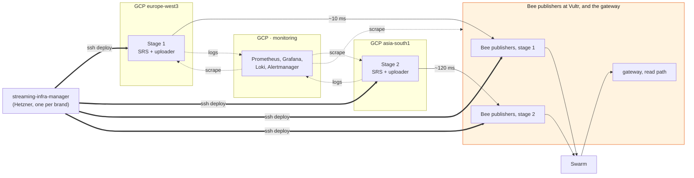

# Rolling out two stages with Terraform

Provisioning plan for the first real deployment: **two stages, one lane, no backup uploaders**, on
Google Cloud, with the Bee publishers on cloud instances of their own at Vultr
([terraform/vultr](../../terraform/vultr/README.md)). Written
2026-08-14, following the decision on 2026-08-12 to plan with Google Cloud
([feasibility/gcp-alibaba-deployment.md](../feasibility/gcp-alibaba-deployment.md)).

One stage is `SRS → stream-uploader → 4 Bee publishers`, one per rung. Two stages is that twice,
plus monitoring. Nothing else from the twenty-stage architecture is in scope: no lane B, no standing
spares, no prefetch fleet, no CDN, no standby stack.

---

## The short version

**Terraform's job is the cloud footing and nothing below it.** Three facts set the boundary:

1. **The uploader fan-out is already built.** `BEE_PUBLISHERS`, the publisher pool, per-rung batch
   buying in the CLI and per-ladder master feeds all landed on
   `feat/multi-feed-abr-on-uploader-hardening` in August. The engineering that looked like the
   critical path is done.
2. **The Bee fleet is handled separately**, in the infra manager repo. Terraform builds the
   machines the publishers run on — a second root, `terraform/vultr` — but does not create,
   configure, place or discover Bee nodes, and does not render `BEE_PUBLISHERS`.
3. **Stream config stays hand-authored for the POC.** `ABR_LADDER`, `BEE_PUBLISHERS`, stamps and
   keys are written by hand. Automating them is a post-POC question.

| | Owner |
|---|---|
| Machines, network, firewalls, addresses, secrets, state | **Terraform** |
| SSH configs (the humans' and the manager's), Prometheus targets, Grafana provisioning | **Terraform renders, applier pushes** |
| Profiles, port slots, per-profile env, containers | **the manager — one per brand, off-cloud, deploying over ssh** |
| Bee host machines, their firewall and their addresses | **Terraform, the `terraform/vultr` root** |
| Bee nodes, `BEE_PUBLISHERS`, `ABR_LADDER`, stamps, keys | **the manager and hand-authored** |

**The rule that keeps Terraform stable: it knows about hosts, never about rungs.** No resource
per rung, no rung count in the resource graph. Everything per-rung now lives above Terraform, which
makes that rule free rather than a discipline.

---

## What Terraform builds

### Google Cloud, existing project

| Resource | Count | Note |
|---|---|---|
| VPC + subnets | 1 + 2 | one subnet per region; not the default network |
| Stage host | 2 | SRS + `stream-uploader`, **deployed onto it over ssh by the off-cloud manager** |
| Monitoring host | 1 | 2 vCPU, separate persistent disk for the TSDB and the log store |
| Static external IP | 3 | two are the floating SRT addresses, and they double as the egress identity the Bee hosts' firewall keys on |
| Firewall rule | 4 + 1/stage | SRT UDP per stage from test sources only; IAP-range SSH; monitoring scrape; log push to Loki; manager UI over IAP only. Two more appear once their address lists are filled: `ssh_source_ranges` puts the manager host's /32 on the stage hosts' tcp 22, and `loki_push_source_ranges` names the Bee hosts. Both are IP-keyed and logged |
| Service account | 3 | stage, monitoring, deployer. Never the default SA |
| Secret Manager secret | ~5 | SRT passphrase per stage, `POSTGRES_PASSWORD` per stage, Grafana admin |
| GCS bucket | 1 | Terraform state, versioned |

### Terraform lives in `terraform/` in this repo

Separate from the application repos, colocated with the plan it implements, and moved out later if
it outgrows that. One root module, `envs/poc.tfvars` for the two stages, GCS backend, plus a
one-off `bootstrap/` root that creates the state bucket the backend needs. The runbook, milestone
by milestone, is [terraform/README.md](../../terraform/README.md).

```hcl
variable "stages" {
  type = map(object({
    region   = string   # europe-west3 | asia-south1
    srt_port = number
    machine  = string
  }))
}
```

Two entries today. Twenty stages is a longer `.tfvars` and no HCL change. If adding a stage means
editing a `.tf` file, this rollout failed its own test.

### What it renders

Short, now that per-rung config is hand-authored:

| Rendered file | Consumed by |
|---|---|
| `ssh_config` fragment, used via `ssh -F` | every human tunnel, over IAP |
| `manager_ssh_config`, one block per host in both clouds | the manager's api container, where `deploy.sh` runs |
| `prometheus/targets/*.json` | Prometheus file_sd |
| `grafana/provisioning/*` | Grafana datasources and dashboards |
| `inventory.json` | anything that needs to know what exists |

**Terraform writes files and never restarts a service.** Config-then-reload ordering is something
Terraform is bad at, and `remote-exec` inside the plan graph is how a plan stops being idempotent.
`deploy/deploy.sh` already does rsync-then-`docker compose up -d`; it stays the applier. The
monitoring stack gets an applier of the same shape, `terraform/stacks/monitoring/push.sh`, which
also carries the alert rules, the compose file and Loki's retention config as static payload.

`swarm-hls-stream/.env` is *not* on that list. It carries the ladder, the publishers and the keys,
so it stays hand-authored and Terraform does not touch it.

---

## One manager per brand, and what it costs

There is one `streaming-infra-manager` for the brand, and it runs on neither cloud: it sits on
the operator's own host and deploys everything else over ssh — the ABR Uploader (SRS plus
`stream-uploader`) onto each stage host, the ABR Node Pools onto the Bee hosts at Vultr. No
manager on a stage host, none on a Bee host, one Postgres for the lot. Its deploys run inside its
api container, which carries a deploy key and the rendered `manager_ssh_config` and reaches both
clouds by public address.

**Three consequences worth naming:**

- **The manager does not compete with ffmpeg for CPU.** A four-rung ladder is about 7 vCPU, and
  on a stage host that is now what the box is for: SRS, the uploader and nothing else. Size to
  the transcode figure and watch steal time during the first real feed.
- **Port slots are global, not per host.** One manager means one Postgres, so the unique
  `port_slot` is unique across every profile on every host — a stage's uploader and a Bee rung
  draw from the same sequence, and no host gets to start at 1 by right.
- **The SRT firewall port follows the slot.** `stages.<key>.srt_port` admits exactly one UDP
  port, and the uploader binds `10001 + 10 × slot`, so the slot the manager hands out has to be
  read off the profile and applied on the GCP side. The same arithmetic bounds the Bee rungs: the
  Vultr firewall admits slots 1 to `ladders_per_host × rungs_per_ladder`, and a rung outside it
  deploys a node nothing can dial.

Reaching in from outside costs three firewall rules across the two roots. The manager host's /32
sits on the stage hosts' tcp 22, on the Bee hosts' sshd, and on the Bee hosts' unauthenticated
API band, which it needs to buy and inspect the postage batches; its deploy key sits in the stage
hosts' instance metadata and the Bee hosts' `authorized_keys`. That is the price of a control
plane in neither cloud, and it is why the GCP rule is logged where the two internal ones beside
it are not.



**The two regions are the measurement.** Same bytes, same code, one uploader roughly 10 ms from its
publishers and one roughly 120 ms away. That only works because the publishers are remote — with
them co-located the hop would be `localhost` in both regions and the comparison would measure
nothing.

**What it does not tell us.** Ingest latency from the venue, because there is no venue feed yet, and
per-node peer-to-peer egress, which still needs [tools/bee-egress](../../tools/bee-egress/) on two
idle nodes for a week. Neither is blocked by this rollout, and neither is answered by it.

---

## Hand-authored config, and why that is safe here

`ABR_LADDER` and `BEE_PUBLISHERS` are checked against each other at uploader startup: every rung in
the ladder must have a publisher and nothing else may, or the uploader refuses to start. **That
makes hand-authoring low-risk** — a mismatch fails loudly, immediately, before any traffic, rather
than silently spending a batch sized for the wrong bitrate. Two things to keep in mind when writing
it:

- **The batch is bracketed, `rung@url<batchid>`.** A `#` opens a comment in that file and would
  truncate the value, losing the batch ids silently.
- **Coordination writes go to the lowest rung's node**, chosen from the ladder rather than from the
  order the variable is written in, so top-down ordering cannot invert it.

---

## Protecting the Bee API

Bee has **no API authentication of any kind** in 2.8.1 — no token, no password, no restricted mode
anywhere in the source. Reaching it is enough to spend a postage batch, upload arbitrary chunks and
write feeds, with the node's wallet behind it. Upstream's own packaged default is `127.0.0.1:1633`
for that reason.

`swarm-hls-stream` now has the knobs for it: `*_API_BIND` for the published port under bridge
networking, `*_API_LISTEN` for the process's own bind under `COMPOSE_NETWORK=host`, where published
ports are ignored entirely and the first pair does nothing. Both default to empty, reproducing the
previous behaviour exactly. P2P stays on every interface in both modes.

**Choosing the address is a Bee-side decision and sits outside this plan.** The one thing worth
carrying across: nothing that talks to a node's API is on the node's host. The stage uploader
dials it across clouds, and so does the manager, which buys and inspects the postage batches —
so binding to `127.0.0.1` cuts off publishing and stamp management together.

The GCP side supports whichever way it goes. The stage hosts have static external IPs, and GCP VM
egress uses the instance's external address, so the allowlist on the Bee side is those two
addresses plus the manager's, and no coordination.

---

## Rollout order

| | What | Done when |
|---|---|---|
| **M0** | Foundations: state bucket, provider pins (`hashicorp/google ~> 7.44`), `terraform/` skeleton, `envs/poc.tfvars` | `terraform apply` twice in a row, second run reports no changes |
| **M1** | Monitoring host, before any stage exists | Grafana reachable over IAP, scraping `node_exporter` on itself |
| **M2** | Stage 1 in `europe-west3`: host, then SRS and uploader deployed onto it from the manager, pointed at existing publishers | test feed in, segment published, played back, visible end to end in Grafana |
| **M3** | Stage 2 in `asia-south1` is one `.tfvars` entry | the A/B number: same feed, two hop latencies |
| **M4** | Rebuild stage 2 from nothing (`terraform apply -replace` of its instance — a full destroy would also release its reserved addresses) | back up inside ~15 minutes with no manual step |

**M1 before M2 is deliberate.** Every component after it is observable from its first boot, which is
the difference between debugging the pipeline and guessing at it. **M4 is the acceptance test for
the whole exercise**: if a stage comes back from nothing without a human remembering something, the
configuration is really in Terraform. If it does not, it was in somebody's shell history.

---

## What this costs

Three VMs, three external static addresses, four disks. Worth costing in the calculator once before
the first apply rather than estimating here.

**The line worth watching is egress, because it is the same meter as the fleet's.** Two stages of a
four-rung ladder plus parity is roughly 12 Mbps leaving GCP, continuously while publishing:

| Window | Volume | GCP egress, list |
|---|---|---|
| A 40-hour test week | ~216 GB (201 GiB) | ~$24 |
| Left running a full month | ~3.9 TB (3,670 GiB) | ~$425 |

Trivial per test, and not trivial if it stays up for the eleven weeks to November. **Bring the pilot
up per test window.** The same arithmetic at 800 nodes is the $26,000 to $205,000 wall in
[feasibility/gcp-alibaba-deployment.md](../feasibility/gcp-alibaba-deployment.md), which is why this
small number is worth metering from the first day rather than after the first invoice.

---

## Open questions

1. **Machine size for the stage hosts.** A four-rung ladder is ~7 vCPU and the box carries nothing
   else, so 8 vCPU should fit; the real number wants one measured run.
2. **How the manager host is protected.** It holds the deploy key to every host in both clouds and
   the whole port-slot allocation in one Postgres, which makes it the single thing whose loss
   costs the most. Its own backup, access and rebuild story is not written down anywhere yet.

Settled: one manager per brand, on a host outside both clouds; Terraform in `terraform/` in this
repo; Bee nodes and their
placement handled separately; `ABR_LADDER` and `BEE_PUBLISHERS` hand-authored for the POC; the
Mumbai host is `asia-south1`, because Live Stream API is not available in `asia-south2`.

---

## What this does not cover

Lane B, standing spares, the 640-node prefetch fleet, the CDN, the standby stack, the multi-stage
player, and the Bee nodes themselves. Each is in
[architecture-plan.md](../architecture-plan.md) or
[feasibility/fleet-hosting.md](../feasibility/fleet-hosting.md).

The Bee **hosts** are covered, in their own root:
[terraform/vultr](../../terraform/vultr/README.md), built on the first-party
[`vultr/vultr`](https://registry.terraform.io/providers/vultr/vultr/latest) provider. One host
carries three ABR ladders — twelve publisher nodes — put there over ssh by the same off-cloud
`streaming-infra-manager` that deploys the stage hosts' uploader, on the same "hosts, never
rungs" rule as this root: the ladder count sizes a firewall port band and nothing else. The two
roots are separate states that meet at two seams — the Vultr root reads this one's stage and
monitoring addresses to allowlist them, and this one takes the Bee hosts' reserved /32s in
`loki_push_source_ranges` so their logs reach Loki. The manager is a third address both roots
name by hand: sshd and the Bee API band at Vultr, sshd on the stage hosts here. Monitoring and
control are therefore cross-cloud and IP-allowlisted, over the public internet, until a
WireGuard mesh replaces that.
