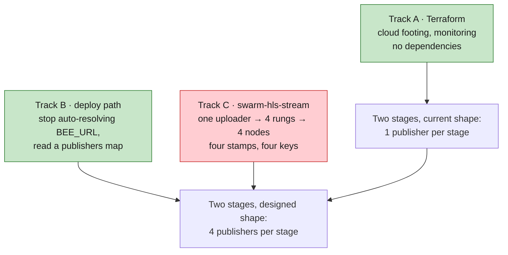
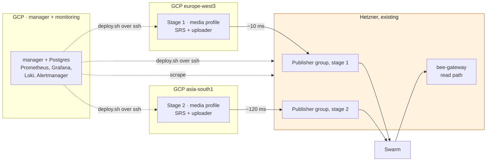

# Rolling out two stages with Terraform

Provisioning plan for the first real deployment: **two stages, one lane, no backup uploaders**,
on Google Cloud with the Bee publishers on our existing Hetzner machines, moving to Vultr later.
Written 2026-08-14, following the decision on 2026-08-12 to plan with Google Cloud
([feasibility/gcp-alibaba-deployment.md](../feasibility/gcp-alibaba-deployment.md)).

One stage is `SRS → stream-uploader → 4 Bee publishers`, one per rung. Two stages is that twice,
plus the monitoring stack. Nothing else from the twenty-stage architecture is in scope: no lane B,
no standing spares, no prefetch fleet, no CDN, no standby stack.

---

## The short version

**Terraform is the smallest part of this, and the plan should not pretend otherwise.** Reading
`streaming-infra-manager` sets the shape:

1. **The seam Terraform should stop at already exists.**
   `swarm-hls-stream/deploy/scripts/deploy.sh` already takes a per-service host map, allocates
   ports from a slot number, renders per-profile env files, and deploys over SSH. The manager
   already owns profiles, stamps and container lifecycle. Terraform rendering Bee compose files
   would rebuild a seam that is there and tested.
2. **Publishers move out of the media profile entirely.** Media on GCP, publishers on
   Hetzner and later Vultr, wired together by a publishers map rather than by co-location. This is
   the decisive simplification in this plan: it deletes the port-slot problem, and it matches where
   the architecture was going anyway.

| | Owner |
|---|---|
| Machines, network, firewalls, addresses, secrets, monitoring host | **Terraform** |
| `config.json`, `manager/.env`, base `.env`, SSH aliases, publisher endpoints, Prometheus targets | **Terraform renders, applier pushes** |
| Profiles, port slots, per-profile env, Bee data dirs, containers | **the manager** |
| Postage batches | **the manager** — `StampService` already does this |
| Chequebook funding, signing keys, the Hetzner machines themselves | **nobody automates these** |

**The rule that keeps Terraform stable across the work still to come: rung count may appear in
`.tfvars`, never in resource topology.** `for_each` over a rungs map to render a config file is
fine. A `google_compute_instance` per rung is not. Terraform learns how many publishers exist as
*data* so it can write their endpoints; it must never grow or shrink its resource graph when the
number changes.

---

## What "two stages" is, concretely

### Google Cloud, existing project

| Resource | Count | Note |
|---|---|---|
| VPC + subnets | 1 + 2 | one subnet per region; not the default network |
| Stage host | 2 | ~8 vCPU each — SRS + `stream-uploader` per stage |
| Manager + monitoring host | 1 | ~4 vCPU, separate persistent disk for the TSDB |
| Static external IP | 3 | two are the floating SRT addresses, and they double as the egress identity the Hetzner allowlist keys on |
| Firewall rule | 4 | SRT UDP from test/venue sources only; IAP-range SSH; monitoring scrape; egress as needed |
| Service account | 3 | stage, monitoring, deployer. Never the default SA |
| Secret Manager secret | ~8 | SRT passphrases, `POSTGRES_PASSWORD`, Bee node passwords, stream signing keys, Grafana admin |
| GCS bucket | 1 | Terraform state, versioned |

### Hetzner, existing machines, not managed by Terraform

8 `bee-uploader` containers, one per rung per stage, plus a `bee-gateway` for the read path,
`node_exporter` per host. Terraform holds these as a static inventory and renders their endpoints;
it does not create them.

### The read path is already in the box

The profile model ships a `bee-gateway` and a `client` whose nginx proxies `/bee` to it. Verifying
a publish needs no new component: deploy `bee-gateway` on the Hetzner side and read through it. A
public gateway stays useful as a second opinion, precisely because it is not ours.

---

## Decoupling the publishers

The media stack and the Bee publishers stop sharing a profile. What that buys, and what it costs:

**It deletes the port-slot problem outright.** `port_slot` shifts every default port by
`slot * 10`, and service identity is the last digit of the default. The defaults are 10000 to
10008 — **nine ports, and all nine are taken** (uploader API, SRS SRT, SRS RTMP, SRS HTTP, client,
Bee uploader API and P2P, Bee gateway API and P2P; OME reuses the SRS SRT and HTTP digits). Four
publishers inside one profile would need six more ports than the scheme has, forcing a stride
change across the port arithmetic, the `port_slot` range check and every default. Publishers in
their own profiles on their own hosts need none of that: each gets its own slot and its own port
pair, and nine stays sufficient forever.

**Four publishers per stage is then expressible with what already exists.** A deployment group of
size 4 with `components: ["bee-uploader"]` and `host: "hetzner-1"` creates four member profiles,
each with its own slot, ports and Bee data dir. Group members share config at creation and can be
differentiated afterwards through the group config update path, which is where the per-rung stamp
lands. No new concept required.

**Slots scale.** At the full twenty stages, four rungs, two lanes, that is 160 publisher profiles
plus 20 media profiles — 180 of the 999 available, and because slots are globally unique a
publisher's port is also a usable fleet-wide node identity for monitoring.

### On a new deploy script, and on `BEE_PUBLISHERS`

**Not deploying bees needs no new script.** Two mechanisms already do it: set
`"bee-uploader": false` in `config.json`, or pass the services positionally —
`deploy.sh --profile=stage1 srs stream-uploader`. The "media only" deploy is a config change today.

**What genuinely has to change is the opposite end: `deploy.sh` auto-resolves `BEE_URL` from
wherever it put `bee-uploader`.** That auto-resolution is what currently guarantees the uploader
and its node agree, and decoupling switches it off. So the change is to *stop inferring* the
endpoint and start reading it — a small, well-defined edit rather than a new script.

**On the input shape: prefer a map file over an env variable.** `BEE_PUBLISHERS` as a flat env
string works for one value and gets fragile fast, because each rung needs three *correlated*
values — endpoint, postage stamp, signing key — and the stamp and key are secrets that should not
sit in a shell argument where they surface in process listings and history. A file alongside the
`config.json` that already exists is the idiomatic fit:

```json
{
  "publishers": {
    "360p":  { "bee_url": "http://10.0.0.11:10005", "stamp": "…", "stream_key": "…" },
    "480p":  { "bee_url": "http://10.0.0.12:10005", "stamp": "…", "stream_key": "…" },
    "720p":  { "bee_url": "http://10.0.0.13:10005", "stamp": "…", "stream_key": "…" },
    "1080p": { "bee_url": "http://10.0.0.14:10005", "stamp": "…", "stream_key": "…" }
  }
}
```

**And it is assembled, not authored in one place.** Terraform knows the hosts, so it writes the
endpoint half. The manager owns stamps and the profile registry, so it fills the stamp half at
deploy time. Signing keys come from Secret Manager. Having one of the three author all three is
how the map goes stale.

**What decoupling does not fix.** The uploader still takes one `BEE_URL`, one `STAMP` and one
`STREAM_KEY`. Driving four rungs into four nodes with four stamps and four keys from one process
is unchanged work, and it is the same item
[architecture-plan.md §6.4](../architecture-plan.md#64-transcode-sizing) calls the top engineering
priority.

---

## What is left to build



Track A and Track B are both small and independent. **Track C is the critical path and always
was.** Track A on its own delivers two stages at one publisher each — the shape that works today,
in two regions, with monitoring. That is a real end-to-end run, not a placeholder, and Track C
lands underneath it without touching Terraform.

---

## Providers

| | Status | Verdict |
|---|---|---|
| **GCP** | `hashicorp/google` v7.44.0, stable, 2.3B downloads | the whole cloud footing |
| **Vultr** | [`vultr/vultr`](https://registry.terraform.io/providers/vultr/vultr/latest) v2.32.0, first-party. `vultr_instance`, `vultr_bare_metal_server`, firewall groups, VPC 2.0, block storage, reserved IPs | yes, and the migration is a module swap |
| **Hetzner Robot** | no first-party provider. Only community: [strng-solutions](https://registry.terraform.io/providers/strng-solutions/hetzner-robot/latest) v4.0.0, [Peters-IT](https://registry.terraform.io/providers/Peters-IT/hetzner-robot/latest), [floshubo/hrobot](https://github.com/floshubo/terraform-provider-hrobot) | none of them. Static inventory variable |

**Put host creation behind a module whose output is an ssh alias, a private address and a role** —
never a provider-specific resource reference. Then Hetzner-to-Vultr swaps `modules/hosts-static`
for `modules/hosts-vultr` and everything downstream, including `config.json` and the publishers
map, is unchanged. Get that interface right on day one and the migration is an afternoon.

---

## Topology, and what the two regions buy

One stage host in **`europe-west3`** next to the Hetzner boxes, one in **`asia-south1`** (Mumbai),
publishers for both on Hetzner. Same bytes, same code, two very different
`stream-uploader → bee` hops: roughly 10 ms against roughly 120 ms.



**Decoupling is what makes this A/B measurable.** With publishers co-located the hop would be
`localhost` in both regions and the comparison would measure nothing. Now the region choice is a
measurement rather than a preference — the same question the fleet decision turns on, asked
cheaply.

**What it does not tell us.** Ingest latency from the venue, because there is no venue feed yet,
and per-node peer-to-peer egress, which still needs [tools/bee-egress](../../tools/bee-egress/) on
two idle nodes for a week. Neither is blocked by this rollout, and neither is answered by it.

---

## Protecting the Bee API

**Deferred deliberately: WireGuard. Not deferred: an address allowlist.** The distinction matters
because of what the API is.

Bee in this version has **no API authentication of any kind** — there is no token, password or
restricted mode in the source. Upstream's own packaged default is `api-addr: 127.0.0.1:1633`,
localhost only, which is the whole design position on the question. Our
`deploy/docker-compose.yml` overrides that to `:1633` and publishes the port, so on a public host
the API is an unauthenticated write surface on the internet: postage spend, arbitrary chunk upload,
feed writes, with the node's wallet behind it.

So the effort comparison resolves before it is run:

| | Effort | Strength | When |
|---|---|---|---|
| **Address allowlist** | minutes — the GCP hosts have static IPs already, so it is two source addresses in `ufw`/`nftables` | good for two fixed hosts | **rides along with the first Hetzner deploy** |
| **WireGuard mesh** | hours, plus config to render and maintain | strong, survives changing addresses | when the fleet moves to Vultr and hosts multiply |
| Bee's own auth | n/a | does not exist | never |

The allowlist is cheap *because* the plan already reserves static external IPs for SRT ingest, and
GCP VM egress uses the instance's external address. That makes the Hetzner rule two lines and no
coordination. WireGuard earns its place later, on host count, not now.

**One code change comes with it either way:** the compose port publish needs a bind-address prefix
so Bee's API can be bound to a specific interface instead of `0.0.0.0`. That belongs in
`swarm-hls-stream`, not Terraform.

Signing keys stay out of both paths: Secret Manager, injected at deploy, never in Terraform state
and never baked into an image. The profile schema already carries `private_key`, so the manager is
the right place for them to arrive.

---

## Rollout order

| | What | Done when |
|---|---|---|
| **M0** | State bucket, provider pins, module skeleton, Hetzner inventory captured, chequebooks funded | `terraform plan` is empty on a second run |
| **M1** | **Monitoring and the manager first**, before any stage exists | Grafana reachable over IAP, scraping Bee `/metrics` and `node_exporter` |
| **M2** | Stage 1: media profile in `europe-west3`, publisher group on Hetzner, allowlist applied, test feed in, playback out through `bee-gateway` | a segment published and played back, visible end to end in Grafana |
| **M3** | Stage 2 in `asia-south1` is one `.tfvars` entry, one `config.json` line and one more publisher group | the A/B number: same feed, two hop latencies |
| **M4** | Destroy stage 2 and rebuild it | back up inside ~15 minutes with no manual step |

**M1 before M2 is deliberate.** Every component after it is observable from its first boot, which
is the difference between debugging the pipeline and guessing at it. **M4 is the acceptance test
for the whole exercise**: if a stage comes back from nothing without a human remembering something,
the configuration is really in Terraform. If it does not, it was in somebody's shell history.

---

## What this costs

Three VMs, three static addresses, two disks. Small enough not to gate the decision, and worth
costing in the calculator once before the first apply rather than estimating here.

**The line worth watching is egress, because it is the same meter as the fleet's.** Two stages of a
four-rung ladder plus parity is roughly 12 Mbps from GCP to Hetzner, continuously while publishing:

| Window | Volume | GCP egress, list |
|---|---|---|
| A 40-hour test week | ~216 GB | ~$26 |
| Left running a full month | ~3.9 TB | ~$470 |

Trivial per test, and not trivial if it stays up for the eleven weeks to November. **Bring the
pilot up per test window.** The same arithmetic at 800 nodes is the $26,000 to $205,000 wall in
[feasibility/gcp-alibaba-deployment.md](../feasibility/gcp-alibaba-deployment.md), which is why
this small number is worth metering from the first day rather than after the first invoice.

---

## Open decisions

1. **Does the manager run one instance driving all hosts, or one per host?** `config.json` and
   `--host` say one instance can drive everything, and the manager mounts the local Docker socket
   for containers it owns. Confirm on a two-host test before committing the topology.
2. **Publisher groups, or four standalone profiles per stage?** Groups give the four members and
   the naming for free; standalone profiles give per-rung config without going through the group
   update path. Groups look right, and the deciding detail is how per-member stamps read back.
3. **Where does the publishers map live?** Rendered next to `config.json` is the obvious answer;
   the open part is the hand-off between Terraform writing endpoints and the manager filling stamps.
4. **`asia-south1` or `asia-south2` for the Mumbai host.** Mumbai, if we ever want the managed
   media path: Live Stream API is not available in Delhi.
5. **Where does the Terraform live?** `streaming-infra-manager` alongside `deploy/`, or its own
   repo. It renders that repo's config files, which argues for living with them.

---

## What this does not cover

Lane B, standing spares, the 640-node prefetch fleet, the CDN, the standby stack, the multi-stage
player, and the Vultr migration itself. Each is in
[architecture-plan.md](../architecture-plan.md) or
[feasibility/fleet-hosting.md](../feasibility/fleet-hosting.md), and none of them changes the
Terraform above so long as stages, lanes and hosts stay map keys.
